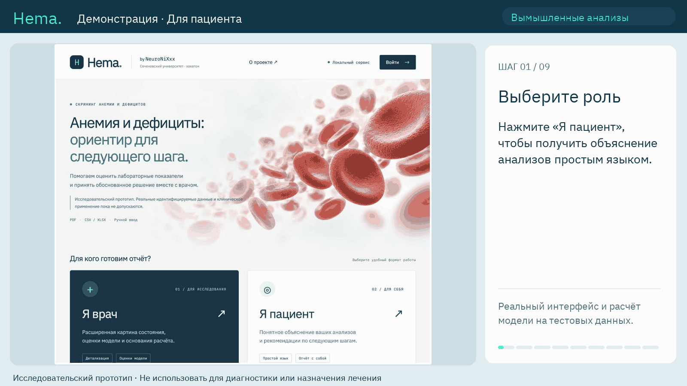

# Hema — MedITron 2026

Исследовательский прототип команды **NeuroNiXxx** по кейсу Сеченовского университета. Принимает лабораторные показатели вручную, из CSV/XLSX или текстового PDF, показывает черновые пояснения для пациента и врача и формирует PDF/JSON-отчёт.

**Выпуск для жюри MedITron. Только синтетические или действительно обезличенные данные. Проект не предназначен для постановки диагноза, назначения лечения или обработки идентифицируемых данных реальных пациентов. Клиническая валидация не выполнена.**

## Посмотреть результат



Демонстрация сделана на вымышленных анализах с ответами настоящего локального API. [Врачебный сценарий](docs/media/hema_doctor_demo.gif). [Краткий маршрут проверки для жюри](docs/JURY_GUIDE.md).

## Скачать и запустить

1. На странице репозитория нажмите **Code → Download ZIP** и распакуйте архив целиком. Можно также клонировать репозиторий: `git clone https://github.com/V1Sp1/MedITron-Hema.git`.
2. Откройте **START_HERE.html** в распакованной папке. [Подробная инструкция macOS и Windows](docs/06_LOCAL_SETUP.md) объясняет установку Python и первый запуск без предварительных технических навыков.
3. Установите **Python 3.12, 64-bit**. Для macOS выполните из папки проекта `bash START_MAC.command`; на Windows дважды щёлкните **START_WINDOWS.bat**.
4. После установки библиотек откройте **http://127.0.0.1:8000/**. Окно сервера оставьте открытым. Для первого запуска нужен интернет; вычисления выполняются локально.

Готовые веса включены. Повторное обучение, Node.js, платные медицинские API и аккаунт инструмента разработки для основного запуска не нужны. На Windows работают текстовые PDF; OCR сканов в этом выпуске доступен только на macOS.

Ручной запуск на macOS:

```sh
python3.12 -m venv .venv
.venv/bin/python -m pip install -c requirements-runtime.txt -e '.[server,model]'
.venv/bin/python -m backend --ocr off
```

Ручной запуск в Windows PowerShell:

```powershell
py -3.12 -m venv .venv
.\.venv\Scripts\python.exe -m pip install -c requirements-runtime.txt -e ".[server,model]"
.\.venv\Scripts\python.exe -m backend --ocr off
```

## Что реализовано

- Пациентский и врачебный интерфейсы, вход врача, ввод 37 признаков и проверка единиц.
- Импорт CSV/XLSX/PDF, проверка распознанных значений человеком, понятные сообщения при неполной панели.
- Правило Hb из кейса, исследовательские оценки baseline_v1 и отдельный прогноз низкого ферритина biochemical_v4 при поддержанном вводе. Измеренный ферритин показывается напрямую; для прогноза требуется определённый контекст беременности.
- Версионированные черновые пояснения, экспорт PDF с кириллицей и JSON.
- Изоляция исследовательских сеансов и врачей, временные медицинские объекты в RAM до часа, удаление, stateless API для тестовых организаций с отзываемыми ключами.

## Архитектура и подробные пояснения

| Раздел | Руководство |
|---|---|
| Каталоги, файлы и архитектура | [Структура проекта](docs/01_PROJECT_STRUCTURE.md) |
| Данные, обучение, выбор и ограничения | [Модели](docs/02_MODEL.md) |
| API, PDF, хранение и доступ | [Бэкенд](docs/03_BACKEND.md) |
| Страницы, импорт и отчёт | [Фронтенд](docs/04_FRONTEND.md) |
| Пояснения и правила их выбора | [Рекомендации](docs/05_RECOMMENDATIONS.md) |
| Установка и устранение проблем | [macOS и Windows](docs/06_LOCAL_SETUP.md) |
| Методика проверок и их границы | [Проверки](docs/07_VERIFICATION.md) |
| Исправления безопасности | [Исследовательский контур](docs/09_SECURITY_REMEDIATION.md) |
| Работающая связка v1 + ферритин v4 | [Гибридный алгоритм](docs/10_HYBRID_MODEL.md) |

Один FastAPI-сервер отдаёт статический фронтенд и API. PDF разбирает отдельный Python-worker. Файлы моделей проверяются по SHA-256 перед загрузкой. Учётные записи сохраняются локально отдельно от временных медицинских объектов.

## Как оценивались модели

baseline_v1 обучен на 840 частично синтетических строках кейса; внутренние метрики не доказывают качество на реальных пациентах. Отдельный ферритин v4 проверен на новых циклах NHANES. Для расширенной панели внешний AUROC низкого ферритина — **0,870867**, F1 — **0,616**; это результат конкретной биохимической задачи и выборки, а не точность диагноза.

[Отчёт baseline_v1](experiments/baseline_v1/REPORT.md), [внешняя проверка v1/v2/v3](experiments/external_validation_v1/REPORT.md), [biochemical_v4](experiments/biochemical_v4/REPORT.md). B12 остаётся слабым; B12/PLP v4 доступны только в отдельном исследовательском CLI. Веса, пороги и выводы не переобучались для публикации.

## Разработка и проверки

Для тестов дополнительно установите `.[test]` в созданное окружение:

```sh
.venv/bin/python -m pip install -c requirements-runtime.txt -e '.[server,model,test]'
.venv/bin/python -m unittest discover -s tests -v
.venv/bin/python scripts/verify_handoff.py --output public_smoke_verification.json
```

На Windows используйте `.\.venv\Scripts\python.exe` вместо `.venv/bin/python`. Для фронтенд-тестов нужен Node.js 20+: из папки `frontend` выполните `npm test` и `npm run build`. Исследовательские проверки с исключёнными построчными наборами пропускаются с явной причиной. Проверки запуска не являются клинической сертификацией.

## Состав публичного выпуска

Включены исходники, подробная документация Markdown/HTML, выбранные модели четырёх семейств, агрегированные результаты и синтетические примеры. Исходные медицинские таблицы, списки обучающих ID, индивидуальные прогнозы, базы аккаунтов, загруженные документы, секреты, личные пути и история рабочего окружения исключены.

В публичных копиях весов удалены только служебные списки ID и пути, обновлены метаданные словаря и хеши доверия. Численные параметры и прогнозы сохранены; исходные артефакты исследования не изменены. Подробности — [RELEASE_NOTES.md](RELEASE_NOTES.md), контрольные суммы — FILES_MANIFEST.json и MODEL_PUBLICATION.json.

Публичная публикация не означает юридического или медицинского допуска к использованию на пациентах. [Документы подготовки будущего клинического выпуска](docs/legal/README.md) являются незаполненными шаблонами. Условия сторонних компонентов и происхождение данных — [THIRD_PARTY_NOTICES.md](THIRD_PARTY_NOTICES.md).
