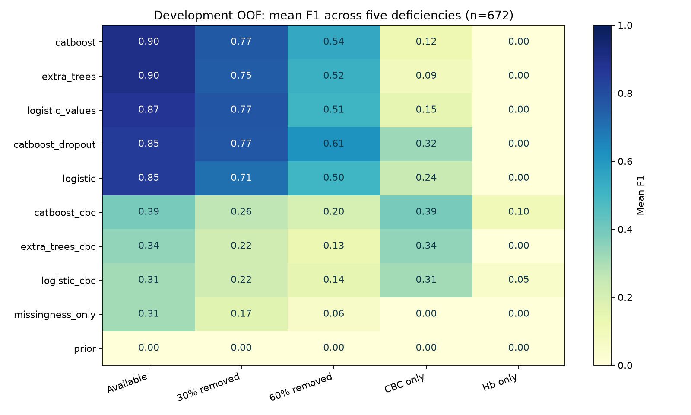
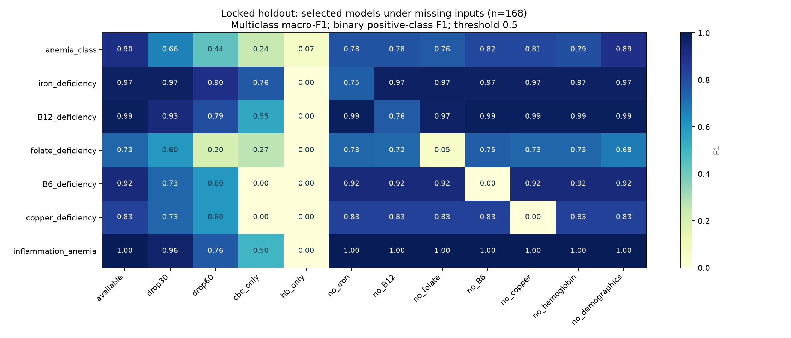
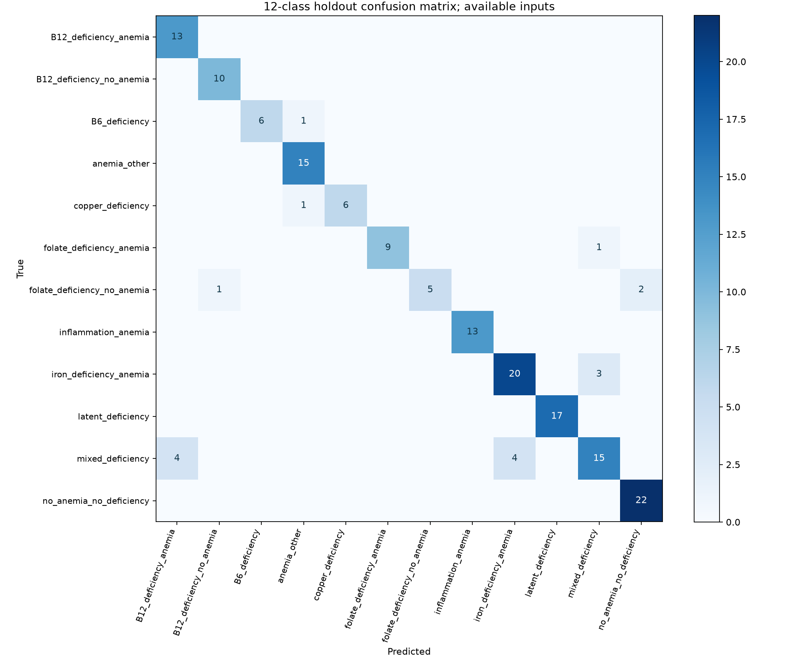
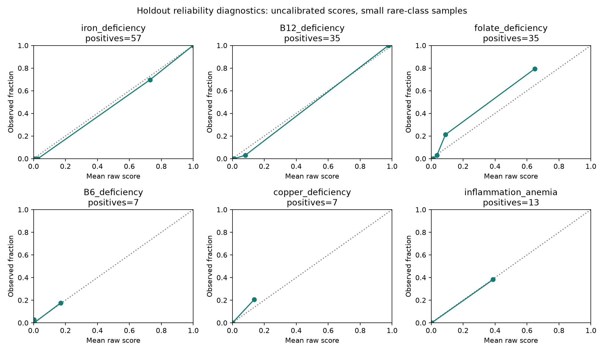

# Техническая реализация модели Hema

Актуальная рабочая сборка от 2026-10-05: baseline_v1 + отдельный прогноз низкого ферритина v4. Case-головы сохранены; измеренный ферритин показывается как анализ. Для прогноза F18–44 нужен отдельный `pregnancyStatus` (`unknown`/`not_pregnant`/`pregnant`, по умолчанию `unknown`). Методика, ограничения, статусы и API — [10_HYBRID_MODEL.md](10_HYBRID_MODEL.md).

Руководство объясняет исследовательский pipeline baseline_v1 и то, как его результаты используются в сервисе. Обучение и API-адаптер имеют разные обязанности: исследовательский inference выдаёт scores, а API проверяет полноту/согласованность и может отказаться от причинного вывода. Метрики эксперимента нельзя приписывать этому дополнительному слою без отдельного измерения.

## Задача и данные

Исходный CSV содержит 840 уникальных пациентов, 48 столбцов, 12 классов, 596 женщин и 244 мужчин. Возраст 18–93. Разметка анемии положительна у 531 пациента. По кейсу набор частично синтетический; доля и способ генерации неизвестны. Эти характеристики проверены для CSV с SHA-256 `9d97e125c961a92222eb31c86188ba7a7736ece1ba59ce296d32e300b107dbb6`, а не для любого будущего файла.

37 потенциальных входов: возраст, пол и 35 лабораторных показателей. Среди них 36,9% значений отсутствует; ни одна строка не содержит всех входов. Внешние наборы не использованы в обучении baseline_v1. Исходные медицинские таблицы не включены в текущий архив; в нём сохраняются справочники, код и сводные результаты. В отдельной серии biochemical_v4 ниже внешние development-циклы используются для других, биохимических целей.

Десять целевых столбцов: anemia, пять отдельных дефицитов, inflammation_anemia, mixed_deficiency, anemia_class, deficiency_cause. Все исключены из X. В этой серии обучаются семь целей: multiclass anemia_class, пять бинарных дефицитов и бинарная inflammation_anemia. Анемия рассчитывается отдельным правилом, mixed_deficiency исследуется как сочетание минимум двух положительных дефицитов; deficiency_cause не является отдельным обученным выходом.

## Правило гемоглобина

При sex=F порог 120 г/л, при sex=M — 130 г/л. Положительный статус анемии задаётся строгим `<`: Hb ровно 120 у женщины или 130 у мужчины не ниже порога. Правило полностью совпало с меткой anemia во всех 840 исходных строках. Это критерий кейса; он не означает, что сервис покрывает беременных, детей и любой клинический контекст.

Исследовательский inference допускает отсутствие Hb/пола и тогда возвращает неизвестный статус. Пользовательский API требует возраст, пол и Hb. Это два разных интерфейса, и их требования нельзя смешивать.

## Код и артефакты

| Файл | Ответственность |
|---|---|
| `ml_baselines/core.py` | FEATURES/CBC/TARGETS, сценарии пропусков, encode, модели и train-only preprocessing |
| `ml_baselines/train.py` | Проверка источника, разбиения, CV, выбор кандидатов, обучение на development, holdout, сохранение |
| `ml_baselines/predict.py` | Загрузка локального bundle, проверки, выбор панели, predict_proba и research JSON |
| `ml_baselines/report.py` | Агрегация результатов и графики отчёта |
| `ml_baselines/requirements.txt` | Закреплённые версии для воспроизводимого исследования |
| `backend/model_service.py` | Проверка готовности bundle, версия по хешу, синхронизация inference и политика отказа |
| `backend/verdicts.py` | Строгий ModelVerdict и согласованность класса, дефицитов, воспалительной цели и Hb |
| `tests/test_ml_baselines.py` | Схемы, кодирование, пропуски, разделение и inference |
| `tests/test_model_api.py` | Настоящие веса, адаптер, роли, ошибка модели и сохранение |

## Представление входов

`encode` выбирает столбцы в фиксированном порядке FEATURES. Пол F кодируется 0, M — 1, отсутствующий пол остаётся NaN. Остальные значения переводятся в числовой float. Не допускаются бесконечности и неизвестный пол. API дополнительно запрещает строки вместо чисел, bool вместо числового поля, отрицательные и нечисловые значения; возраст — целое 18–120. Это проверка формата, не полный контроль физиологической правдоподобности.

ОАК-панель CBC содержит возраст, пол, Hb, RBC, hematocrit, MCV, MCH, MCHC, RDW, platelets, WBC. Это 11 входов, из них 9 лабораторных. Остальные лабораторные признаки задают расширенную панель. Маршрут `auto`: если все имеющиеся лабораторные значения относятся к CBC, выбирается отдельная CBC-модель; при наличии любого дополнительного лабораторного значения — primary. Количество значений и полнота сами по себе не определяют маршрут.

## Десять фиксированных конфигураций

| Имя | Алгоритм и preprocessing | Роль |
|---|---|---|
| prior | DummyClassifier(strategy=prior) | Базовая частота класса, контроль |
| logistic | Медиана + явные индикаторы пропусков + StandardScaler + LogisticRegression | Основной кандидат |
| logistic_values | Медиана без явных индикаторов + StandardScaler + LogisticRegression | Сравнение влияния масок |
| extra_trees | Медиана + индикаторы + ExtraTreesClassifier | Основной кандидат |
| catboost | CatBoostClassifier с числовыми NaN | Основной кандидат |
| catboost_dropout | CatBoost с пятью представлениями обучающих пациентов | Устойчивость к пропускам |
| logistic_cbc | Логистическая модель только CBC | Кандидат ОАК |
| extra_trees_cbc | Extra Trees только CBC | Кандидат ОАК |
| catboost_cbc | CatBoost только CBC | Кандидат ОАК |
| missingness_only | LogisticRegression только по маскам доступности | Диагностика зависимости от назначения анализов |

Логистическая регрессия: C=1, max_iter=3000; контроль по маскам max_iter=2000. Extra Trees: 250 деревьев, max_depth=10, min_samples_leaf=3, max_features=0.8, n_jobs=4. CatBoost: 250 итераций, depth=4, learning_rate=0.06, l2_leaf_reg=5, четыре потока; MultiClass для 12 классов и Logloss для бинарных задач. Параметры фиксированы, grid search, early stopping и калибровки нет.

Импутер оценивает медианы только на train-части конкретного разбиения. Валидирующие и holdout значения не участвуют в fit. Маска пропусков — отдельный числовой индикатор наличия анализа. При этом отсутствие явной маски не гарантирует отсутствие информации о пропусках: медианная подстановка тоже оставляет след. Для CatBoost NaN не подменяется нулём.

## Разбиения и выбор

1. Проверяется хеш источника, 840 строк, уникальность patient_id, отсутствие пропусков целевых меток и повторных векторов входов. При повторах требуется групповое разбиение, и текущий скрипт останавливается.
2. Train_test_split выделяет 20% (168 пациентов) в holdout со стратификацией по anemia_class. Development содержит 672 пациента. Seed=20261003.
3. На development строится StratifiedKFold: 5 общих разбиений, shuffle=True, seed+1. Для каждого target проверяется наличие всех классов в train/validation.
4. Каждая конфигурация обучается отдельно для каждой из 7 целей. CV-предсказания на validation собираются в OOF, то есть каждый development-пациент прогнозируется моделью, не обученной на нём.
5. Primary выбирается по среднему F1 на available/drop30/drop60. Для multiclass это macro-F1, для бинарной цели — F1 положительного класса. prior и missingness_only не могут быть рабочими победителями. CBC-победитель отдельно выбирается среди трёх *_cbc по available. Совпадения разрешаются стабильной сортировкой имени.
6. `selection.json` записывается до расчёта holdout. Все конфигурации финально обучаются на 672 development-пациентах, но holdout оценивает выбранных кандидатов.
7. Создаются полные артефакты, агрегаты, subgroup-анализ и отчёт. Веса не дообучаются на holdout.

Сравнение и выбор на одних OOF могут дать оптимистичную оценку победителя; отдельный holdout уменьшает эту проблему, но не заменяет внешнюю валидацию. Bootstrap-интервалы F1: 300 выборок пациентов, приблизительные 95% границы, не оценка переносимости на другую клинику.

## Сценарии неполного ввода

available сохраняет исходную неполную панель. drop30/drop60 удаляет 30%/60% реально измеренных лабораторных результатов по каждому пациенту; возраст и пол сохраняются, Hb может быть скрыт. cbc_only оставляет CBC; hb_only оставляет возраст/пол/Hb. no_iron, no_B12, no_folate, no_B6, no_copper удаляют соответствующие группы. no_hemoglobin удаляет Hb, no_demographics — возраст и пол. Всего 12 сценариев.

Для catboost_dropout на train создаются исходная панель, drop30, drop60, CBC и удаление одной случайной группы. Метки повторяются для этих представлений. Это пять видов одного пациента, а не увеличение числа независимых пациентов в пять раз. Представления строятся после разделения пациентов, поэтому не пересекают границу train/validation.

## Выбранные модели и результаты

Таблица ниже берётся из сохранённого `selection.json`. В ней CV score primary — критерий выбора на трёх сценариях, CBC score — F1 по исходным доступным CBC. Это разные критерии, их не следует сравнивать как качество на одной панели.

| Цель | Primary | CV score | CBC | CV score CBC |
|---|---|---:|---|---:|
| anemia_class | extra_trees | 0.685730 | catboost_cbc | 0.474134 |
| iron_deficiency | catboost_dropout | 0.933421 | extra_trees_cbc | 0.779043 |
| B12_deficiency | catboost_dropout | 0.861047 | logistic_cbc | 0.539326 |
| folate_deficiency | catboost_dropout | 0.658388 | catboost_cbc | 0.372881 |
| B6_deficiency | catboost | 0.657131 | catboost_cbc | 0.222222 |
| copper_deficiency | catboost | 0.730097 | catboost_cbc | 0.066667 |
| inflammation_anemia | catboost_dropout | 0.873985 | logistic_cbc | 0.455696 |


## Артефакты эксперимента

`models/selected.joblib` содержит schema_version=1.0, выбранные модели по паре (имя конфигурации, target), словарь конфигураций, labels, FEATURES, training_rows, dictionary_sha256, research_only и threshold=0.5. Модели и fitted preprocessing сериализованы вместе. `models/*.joblib` сохраняют остальные конфигурации по всем целям. Не нужно запускать обучение для открытия сайта.

`manifest.json` содержит версии библиотек/Python, платформу обучения, seed, хеш CSV, хеш словаря, параметры, сценарии, хеши исходников и время. `splits.csv` хранит индексы строк, partition и fold. `metrics.csv` содержит агрегаты по модели/цели/сценарию/partition, `per_class.csv` — precision/recall/F1/support каждого класса. `selection_scores.csv` — рейтинг выбора. `oof_probabilities.npz` и `holdout_probabilities.npz` — матрицы scores. `holdout_confusion.json` — confusion matrices. `mixed_metrics.csv`, `subgroups.csv`, `timings.csv` — сочетания, подгруппы и время. PNG-файлы в корне эксперимента — изображения. `REPORT.md` объясняет результаты и их ограничения.

На available holdout первичная multiclass-модель дала macro-F1 около 0.903, после drop60 — около 0.437. Это пример падения при пропусках, а не гарантия для произвольного нового пациента. Полные числовые результаты и слабые задачи приведены ниже в оригинальном отчёте. Для B6/меди всего по 35 исходных положительных примеров; CBC-качество особенно слабое. Доступность B6/меди связана с разметкой, поэтому контроль по маскам существенен. Наличие анализа не равно клиническому признаку болезни.

## Исследовательский inference

`predict` проверяет whitelist, конечность и неотрицательность чисел, пол, схему bundle и хеш словаря. Затем кодирует одну строку и выбирает CBC/primary. Для каждой цели вызывается predict_proba, порядок выходов согласуется с labels. Для inflammation_anemia при известных нормальных Hb/поле исследовательская оценка принудительно равна 0 у рабочих конфигураций; при неизвестном Hb/поле остаётся исследовательский прогноз. Цель обозначает воспалительную анемию, не любое воспаление.

Бинарное решение в API положительно при score >=0.5. Класс — максимум multiclass scores. Для смешанного состояния нельзя перемножать два scores и называть результат вероятностью сочетания. Значения 0–1 не откалиброваны и не являются проверенной вероятностью болезни.

## Подключение к API и отказ от вывода

ModelService вычисляет SHA-256 weights, проверяет schema_version, FEATURES, dictionary hash, семь целей, все 12 class labels, бинарные labels=[0,1], наличие выбранных моделей в обеих панелях. Пробный inference выполняется для primary и CBC ещё до объявления ready. Проверяются конечность каждого score, диапазон 0–1 и сумма по цели около 1. Версия отчёта имеет вид `hema-baseline-v1-` плюс первые 12 символов хеша weights. Inference защищён Lock.

Недоступные/повреждённые веса, несовместимая схема или ошибка библиотек дают unavailable, health degraded и predict 503. Автоматической подмены демо нет. `--no-model` — явно выбранный режим только правила Hb.

Слой API сначала оценивает полноту. Если лабораторных значений меньше 5 или отсутствуют основные входы, состояние suppressed_sparse: причинный вывод и числовые оценки в отчёте не выдаются. Сам ModelService сначала вычисляет scores, затем подавляет их публикацию; это не экономия inference.

При достаточном числе полей проверяются: класс против Hb, одиночный класс против списка дефицитов, no_anemia_no_deficiency/anemia_other против положительных дефицитов, latent_deficiency против отсутствующих положительных решений, mixed_deficiency против числа компонентов, воспалительная цель против Hb и класса. Дополнительно API требует для latent_deficiency ровно iron в соответствии с данным CSV. Если максимум class scores меньше 0.5, либо пытаются исключить причины на недостаточно широкой панели, статус uncertain. Специфические фразы подавляются. Причины записываются в decisionReasonCodes и verdictContext.reasonCodes.

При неопределённости числовые исследовательские scores могут сохраняться в отчёте, но не превращаются в положительный причинный вывод. Для 12 классов список scores передаётся только при анемии. Признак deficiencies становится null при отсутствии разрешённого вывода. Нормальный Hb остаётся нормальным по правилу даже при противоречивом классификаторе.

Это политика согласованности прототипа. Минимум 5, порог воздержания 0.5 и покрытие broader не клинически валидированы. Метрики ниже оценивают исходные исследовательские классификаторы, а не суммарный сервис с отказами.

## Воспроизведение обучения

После основной установки добавьте зависимости исследования:

```sh
python -m pip install -r ml_baselines/requirements.txt
python -m ml_baselines.train --source data/case/deficiency_anemia.csv --output experiments/baseline_v2
```

Здесь `python` означает интерпретатор вашего .venv; в руководстве запуска приведены точные команды для ОС. Используйте новый несуществующий каталог. Обучение может быть длительным, не закрывайте терминал. Нельзя перезаписывать baseline_v1 или менять хеш в словаре ради прохождения проверки нового датасета. Для новых данных сначала повторите аудит, определите правила разметки и заново спланируйте оценку. Фиксированный seed не гарантирует побитовое совпадение на другой ОС/CPU.

Запуск research inference для JSON:

```sh
python -m ml_baselines.predict --bundle experiments/baseline_v1/models/selected.joblib --input patient.json
```

Пример patient.json: `{"sex":"F","age_years":42,"hemoglobin":108,"ferritin":9}`. Этот CLI показывает исследовательские оценки даже на малой панели; пользовательский API дополнительно отказывается от причинного вывода.

## Изменение модели

Добавляйте новую конфигурацию в core.py и проводите новую серию с неизменными разделениями там, где это оправдано. Не используйте holdout для выбора порогов и параметров. Проверяйте новые модели на пропусках, подгруппах и зависимости от наличия анализа. При переключении весов используйте `--model-bundle`; храните старую версию для сравнения. Bundle joblib — исполняемая сериализация: в приложении используются только доверенные локальные weights, загрузка произвольных весов из браузера не предусмотрена.

## Оригинальный подробный отчёт baseline_v1

Следующий текст приведён из сохранённого REPORT.md без переоценки качества.

# Первые локальные модели Hema

Эксперимент 0.1.0, завершён 2026-10-03T18:32:18.974496+03:00. Исходный CSV 840 строк; SHA-256 `9d97e125c961a92222eb31c86188ba7a7736ece1ba59ce296d32e300b107dbb6`.

## Метод

- Только исходный CSV кейса; внешние данные и дополнительные пациенты не использованы.
- 672 пациента development, 168 holdout (20%, стратификация по 12 классам). Пять общих development-разбиений. `splits.csv` содержит исходные индексы строк, -1 означает holdout.
- Все десять конфигураций и семь задач используют одинаковые разбиения. Идентификаторы и все целевые столбцы исключены из входов.
- Параметры заданы до оценки; порог бинарных решений 0,5. Нет подбора на holdout, early stopping или калибровки. Выбор сделан по development OOF до открытия holdout. Сравнение и выбор на одних OOF означает, что CV-оценка выбранного победителя может быть оптимистичной; holdout служит отдельной проверкой.
- Основной критерий: средний F1 на доступных данных, при удалении 30% и 60% измеренных лабораторных результатов. Для 12 классов используется macro-F1, для бинарных задач — F1 положительного класса. ОАК-кандидат выбирается отдельно среди трёх моделей по ОАК.
- CatBoost работает с числовыми NaN. Логистическая регрессия и Extra Trees используют медианы обучающей части и маски пропусков. В `logistic_values` явной маски нет, но импутация всё равно может оставлять след наличия анализа. `missingness_only` видит только наличие признаков, без значений и без правила Hb.
- `catboost_dropout`: пять представлений каждого обучающего пациента — исходное, удаление 30%, удаление 60%, ОАК, удаление одной случайной панели. Они создаются после разделения пациентов и никогда не пересекают границу train/validation. Это моделирование пропусков, не новые независимые пациенты.
- Число анализов не фиксировано. «Доступные данные» — исходная неполная панель CSV. Drop30/60 удаляет указанную долю уже присутствующих лабораторных результатов, иногда включая Hb, сохраняя возраст и пол. `cbc_only` содержит возраст, пол и девять показателей ОАК; `hb_only` — возраст, пол, Hb. Остальные сценарии удаляют именованные панели или демографию.
- Анемия по Hb — отдельное правило, не обучаемая цель. Для inflammation_anemia при известных нормальных Hb/поле score=0; при пропусках остаётся исследовательский прогноз. Модель обучена на всей выборке, оценивается как метка воспалительной анемии, не любого воспаления.
- 95% интервалы F1 — 300 повторов bootstrap пациентов holdout; это приблизительная неопределённость выборки, не доказательство переносимости. В development приводится также разброс F1 по пяти разбиениям.

## Выводы первой серии

- `anemia_class`: `extra_trees` для основной панели, `catboost_cbc` для ОАК. Holdout F1 основной модели: 0.903; при удалении 60% результатов: 0.437.
- `iron_deficiency`: `catboost_dropout` для основной панели, `extra_trees_cbc` для ОАК. Holdout F1 основной модели: 0.974; при удалении 60% результатов: 0.895.
- `B12_deficiency`: `catboost_dropout` для основной панели, `logistic_cbc` для ОАК. Holdout F1 основной модели: 0.986; при удалении 60% результатов: 0.794.
- `folate_deficiency`: `catboost_dropout` для основной панели, `catboost_cbc` для ОАК. Holdout F1 основной модели: 0.727; при удалении 60% результатов: 0.200.
- `B6_deficiency`: `catboost` для основной панели, `catboost_cbc` для ОАК. Holdout F1 основной модели: 0.923; при удалении 60% результатов: 0.600.
- `copper_deficiency`: `catboost` для основной панели, `catboost_cbc` для ОАК. Holdout F1 основной модели: 0.833; при удалении 60% результатов: 0.600.
- `inflammation_anemia`: `catboost_dropout` для основной панели, `logistic_cbc` для ОАК. Holdout F1 основной модели: 1.000; при удалении 60% результатов: 0.762.

Выбор различается по целям: одной универсальной победившей модели нет. CatBoost со скрытием данных выигрывает по критерию устойчивости для железа/B12/фолатов/воспалительной анемии; исходный CatBoost — для B6/меди; Extra Trees — для 12 классов. Все эти решения зафиксированы по development, не по таблице holdout.

Для продукта предлагаем раздельные режимы расширенной панели и ОАК. При отсутствии нужной панели особенно осторожно трактовать фолаты, B6 и медь: нулевой F1 при пороге 0,5 не означает отсутствие состояний у пациентов. Он означает, что модель не обнаружила положительные случаи в данном эксперименте. Подбор иных порогов и калибровка — следующий эксперимент на development с отдельной последующей проверкой. Финальный выбор требует проверки на реальных данных.

## Development: пять дефицитов

Среднее пяти бинарных F1. Эти значения не являются accuracy.

| config | available | drop30 | drop60 | cbc_only | hb_only |
| --- | --- | --- | --- | --- | --- |
| catboost | 0.896 | 0.765 | 0.544 | 0.119 | 0.000 |
| extra_trees | 0.895 | 0.755 | 0.516 | 0.092 | 0.000 |
| logistic_values | 0.873 | 0.773 | 0.506 | 0.147 | 0.000 |
| catboost_dropout | 0.850 | 0.767 | 0.614 | 0.323 | 0.000 |
| logistic | 0.849 | 0.707 | 0.501 | 0.242 | 0.000 |
| catboost_cbc | 0.388 | 0.264 | 0.203 | 0.388 | 0.103 |
| extra_trees_cbc | 0.342 | 0.222 | 0.127 | 0.342 | 0.000 |
| logistic_cbc | 0.311 | 0.219 | 0.145 | 0.311 | 0.049 |
| missingness_only | 0.310 | 0.166 | 0.057 | 0.000 | 0.000 |
| prior | 0.000 | 0.000 | 0.000 | 0.000 | 0.000 |



## Development: 12 классов

| config | available | drop30 | drop60 | cbc_only | hb_only |
| --- | --- | --- | --- | --- | --- |
| catboost | 0.795 | 0.559 | 0.329 | 0.317 | 0.095 |
| catboost_cbc | 0.474 | 0.309 | 0.145 | 0.474 | 0.041 |
| catboost_dropout | 0.765 | 0.634 | 0.474 | 0.450 | 0.112 |
| extra_trees | 0.868 | 0.713 | 0.476 | 0.237 | 0.085 |
| extra_trees_cbc | 0.469 | 0.344 | 0.220 | 0.469 | 0.080 |
| logistic | 0.816 | 0.640 | 0.419 | 0.193 | 0.068 |
| logistic_cbc | 0.457 | 0.346 | 0.219 | 0.457 | 0.126 |
| logistic_values | 0.850 | 0.694 | 0.510 | 0.321 | 0.114 |
| missingness_only | 0.260 | 0.163 | 0.071 | 0.019 | 0.019 |
| prior | 0.035 | 0.035 | 0.035 | 0.035 | 0.035 |

## Выбор, зафиксированный до holdout

| target | primary | primary_cv_score | cbc | cbc_cv_score |
| --- | --- | --- | --- | --- |
| anemia_class | extra_trees | 0.686 | catboost_cbc | 0.474 |
| iron_deficiency | catboost_dropout | 0.933 | extra_trees_cbc | 0.779 |
| B12_deficiency | catboost_dropout | 0.861 | logistic_cbc | 0.539 |
| folate_deficiency | catboost_dropout | 0.658 | catboost_cbc | 0.373 |
| B6_deficiency | catboost | 0.657 | catboost_cbc | 0.222 |
| copper_deficiency | catboost | 0.730 | catboost_cbc | 0.067 |
| inflammation_anemia | catboost_dropout | 0.874 | logistic_cbc | 0.456 |

## Holdout: выбранные основные модели, исходная панель

Для anemia_class F1 означает macro-F1, positive_n/precision/recall не определены. Отдельные классы приведены ниже. Для бинарных задач — F1, precision, sensitivity, specificity и average precision (PR-AUC).

| target | config | n | positive_n | f1 | precision | recall | specificity | pr_auc | f1_ci_low | f1_ci_high |
| --- | --- | --- | --- | --- | --- | --- | --- | --- | --- | --- |
| anemia_class | extra_trees | 168 | — | 0.903 | — | — | — | — | 0.836 | 0.945 |
| B6_deficiency | catboost | 168 | 7.000 | 0.923 | 1.000 | 0.857 | 1.000 | 0.867 | 0.667 | 1.000 |
| copper_deficiency | catboost | 168 | 7.000 | 0.833 | 1.000 | 0.714 | 1.000 | 0.910 | 0.500 | 1.000 |
| iron_deficiency | catboost_dropout | 168 | 57.000 | 0.974 | 0.966 | 0.982 | 0.982 | 0.999 | 0.937 | 1.000 |
| B12_deficiency | catboost_dropout | 168 | 35.000 | 0.986 | 1.000 | 0.971 | 1.000 | 0.999 | 0.947 | 1.000 |
| folate_deficiency | catboost_dropout | 168 | 35.000 | 0.727 | 1.000 | 0.571 | 1.000 | 0.895 | 0.609 | 0.855 |
| inflammation_anemia | catboost_dropout | 168 | 13.000 | 1.000 | 1.000 | 1.000 | 1.000 | 1.000 | 1.000 | 1.000 |

## Holdout: отдельно обученные модели ОАК

| target | config | f1 | recall | pr_auc |
| --- | --- | --- | --- | --- |
| B12_deficiency | logistic_cbc | 0.615 | 0.571 | 0.714 |
| inflammation_anemia | logistic_cbc | 0.522 | 0.462 | 0.490 |
| iron_deficiency | extra_trees_cbc | 0.800 | 0.772 | 0.858 |
| anemia_class | catboost_cbc | 0.467 | — | — |
| folate_deficiency | catboost_cbc | 0.217 | 0.143 | 0.415 |
| B6_deficiency | catboost_cbc | 0.250 | 0.143 | 0.397 |
| copper_deficiency | catboost_cbc | 0.000 | 0.000 | 0.102 |

## Неполный ввод на holdout

Основные выбранные модели применены к сокращённым входам; это стресс-тест. Строка cbc_only для них не заменяет результат отдельно обученных ОАК-моделей.

| target | available | drop30 | drop60 | cbc_only | hb_only | no_iron | no_B12 | no_folate | no_B6 | no_copper | no_hemoglobin | no_demographics |
| --- | --- | --- | --- | --- | --- | --- | --- | --- | --- | --- | --- | --- |
| anemia_class | 0.903 | 0.663 | 0.437 | 0.243 | 0.065 | 0.785 | 0.778 | 0.761 | 0.815 | 0.813 | 0.792 | 0.894 |
| iron_deficiency | 0.974 | 0.973 | 0.895 | 0.764 | 0.000 | 0.748 | 0.974 | 0.974 | 0.974 | 0.974 | 0.974 | 0.974 |
| B12_deficiency | 0.986 | 0.925 | 0.794 | 0.548 | 0.000 | 0.986 | 0.759 | 0.971 | 0.986 | 0.986 | 0.986 | 0.986 |
| folate_deficiency | 0.727 | 0.600 | 0.200 | 0.269 | 0.000 | 0.727 | 0.724 | 0.054 | 0.750 | 0.727 | 0.727 | 0.679 |
| B6_deficiency | 0.923 | 0.727 | 0.600 | 0.000 | 0.000 | 0.923 | 0.923 | 0.923 | 0.000 | 0.923 | 0.923 | 0.923 |
| copper_deficiency | 0.833 | 0.727 | 0.600 | 0.000 | 0.000 | 0.833 | 0.833 | 0.833 | 0.833 | 0.000 | 0.833 | 0.833 |
| inflammation_anemia | 1.000 | 0.960 | 0.762 | 0.500 | 0.000 | 1.000 | 1.000 | 1.000 | 1.000 | 1.000 | 1.000 | 1.000 |



## Классы и смешанные состояния

| label | support | precision | recall | f1 |
| --- | --- | --- | --- | --- |
| B12_deficiency_anemia | 13 | 0.765 | 1.000 | 0.867 |
| B12_deficiency_no_anemia | 10 | 0.909 | 1.000 | 0.952 |
| B6_deficiency | 7 | 1.000 | 0.857 | 0.923 |
| anemia_other | 15 | 0.882 | 1.000 | 0.938 |
| copper_deficiency | 7 | 1.000 | 0.857 | 0.923 |
| folate_deficiency_anemia | 10 | 1.000 | 0.900 | 0.947 |
| folate_deficiency_no_anemia | 8 | 1.000 | 0.625 | 0.769 |
| inflammation_anemia | 13 | 1.000 | 1.000 | 1.000 |
| iron_deficiency_anemia | 23 | 0.833 | 0.870 | 0.851 |
| latent_deficiency | 17 | 1.000 | 1.000 | 1.000 |
| mixed_deficiency | 23 | 0.789 | 0.652 | 0.714 |
| no_anemia_no_deficiency | 22 | 0.917 | 1.000 | 0.957 |



Смешанный результат — минимум два положительных решения отдельных моделей, не вероятность сочетания. Категория mixed без анемии отсутствует в исходном CSV; это ограничение данных, не клинический запрет.

| scenario | positive_n | f1 | precision | recall |
| --- | --- | --- | --- | --- |
| available | 23 | 0.769 | 0.938 | 0.652 |
| drop30 | 23 | 0.686 | 1.000 | 0.522 |
| drop60 | 23 | 0.438 | 0.778 | 0.304 |
| cbc_only | 23 | 0.256 | 0.312 | 0.217 |
| hb_only | 23 | 0.000 | 0.000 | 0.000 |
| no_iron | 23 | 0.545 | 0.571 | 0.522 |
| no_B12 | 23 | 0.684 | 0.867 | 0.565 |
| no_folate | 23 | 0.400 | 0.857 | 0.261 |
| no_B6 | 23 | 0.769 | 0.938 | 0.652 |
| no_copper | 23 | 0.769 | 0.938 | 0.652 |
| no_hemoglobin | 23 | 0.750 | 0.882 | 0.652 |
| no_demographics | 23 | 0.757 | 1.000 | 0.609 |

## Дефициты при нормальном Hb

| target | n | positive_n | f1 | precision | recall |
| --- | --- | --- | --- | --- | --- |
| iron_deficiency | 58 | 17 | 0.971 | 0.944 | 1.000 |
| B12_deficiency | 58 | 10 | 0.947 | 1.000 | 0.900 |
| folate_deficiency | 58 | 8 | 0.667 | 1.000 | 0.500 |
| B6_deficiency | 58 | 1 | 1.000 | 1.000 | 1.000 |
| copper_deficiency | 58 | 0 | 0.000 | 0.000 | 0.000 |

## Контроль зависимости от назначения анализов

Модель только на маске наличия признаков, development OOF:

| target | f1 | pr_auc | recall |
| --- | --- | --- | --- |
| anemia_class | 0.260 | — | — |
| iron_deficiency | 0.514 | 0.539 | 0.481 |
| B12_deficiency | 0.402 | 0.506 | 0.310 |
| folate_deficiency | 0.061 | 0.280 | 0.033 |
| B6_deficiency | 0.000 | 0.139 | 0.000 |
| copper_deficiency | 0.571 | 0.590 | 0.429 |
| inflammation_anemia | 0.000 | 0.154 | 0.000 |

Высокий результат этого контроля означает, что паттерн назначенных исследований информативен в данной выборке. Он не является диагностическим правилом. Искусственное скрытие проверяет один вид сдвига; реальные механизмы пропусков могут отличаться.

## Вероятности и ограничения



- Scores пока не откалиброваны. Brier/log loss и reliability plots сохранены для оценки, но низкий Brier сам по себе не доказывает хорошую калибровку.
- Всего по 35 положительных пациентов B6/меди; на holdout по 7. Их полнота и интервалы нестабильны. Один seed/holdout — первая серия, а не окончательное ранжирование.
- При идеальных либо полностью нулевых решениях bootstrap-интервал может выродиться в [1,1] или [0,0]. Это свойство наблюдённой выборки, не доказательство отсутствия ошибки вне неё.
- Данные частично синтетические, происхождение разметки неизвестно. Качество здесь измеряет совпадение с CSV, не клиническую точность.
- Отсутствие анализов не равно норме. При пустой лабораторной панели inference возвращает «недостаточно данных». Для прочих неполных панелей сохраняются исследовательские scores и предупреждения; клинический минимальный набор и пороги отказа ещё не утверждены.
- Прямой классификатор классов и независимые дефициты могут расходиться. В этой серии они сравниваются отдельно и не объединяются в клинический диагноз.
- Модели сохранены после обучения на 672 development-пациентах, holdout не включён в финальный fit. Baseline_v1 подключена к исследовательскому API/сайту по умолчанию; минимальная панель и несогласованный вывод ограничиваются отдельным адаптером.

## Артефакты и воспроизведение

`manifest.json` — версии, схема, хеши и параметры; `metrics.csv` — все сценарии и fold-статистика; `per_class.csv` — классы; `selection.json` — выбор; `selection_scores.csv` — критерий выбора; `oof_probabilities.npz` и `holdout_probabilities.npz` — вероятности в порядке splits.csv; `subgroups.csv` — пол/анемия; `mixed_metrics.csv` — смешанные решения; `models/` — десять наборов и selected.joblib.

Запуск нового обучения после получения разрешённого CSV: `.venv/bin/python -m ml_baselines.train --source /полный/путь/к/разрешенному.csv --output experiments/baseline_v2`. Существующая папка эксперимента никогда не перезаписывается. Код ожидает согласованную схему/контроль источника; произвольный другой CSV требует нового протокола, а не подмены контрольной суммы. Описание inference и зависимостей — `ml_baselines/README.md`.

Документация: [CatBoost NaN](https://catboost.ai/docs/en/concepts/algorithm-missing-values-processing), [imputation pipelines](https://scikit-learn.org/stable/modules/impute.html), [cross-validation](https://scikit-learn.org/stable/modules/cross_validation.html), [calibration](https://scikit-learn.org/stable/modules/calibration.html).

## Последующие семейства и внешняя проверка

Основные таблицы этого руководства относятся только к baseline_v1 и исходному кейсу. Подробные протоколы последующих исследований передаются отдельно:

| Исследование | Код и результат | Как используется |
|---|---|---|
| robust_v2 | `ml_baselines/advanced.py`, `improve.py`, `improvement_report.py`; [отчёт](../experiments/robust_v2/REPORT.md) | Шесть новых конфигураций, сравнение выигрышей/регрессий; отдельный кандидат, default не заменён |
| calibrated_v3 | `ml_baselines/calibration.py`, `calibrate.py`, `calibration_report.py`; [отчёт](../experiments/calibrated_v3/REPORT.md) | Вложенная проверка преобразований scores; 10/14 голов преобразованы по кейсу, клиническая вероятность не подтверждена |
| external_validation_v1 | `ml_baselines/external_validate.py`, `external_validation_report.py`; [отчёт](../experiments/external_validation_v1/REPORT.md) | Замороженные v1/v2/v3 проверены на NHANES 2005–2006; биохимические ориентиры, не подтверждённые диагнозы |
| biochemical_v4 | `ml_baselines/biochemical.py`, `train_biochemical.py`, `nhanes_v4.py`, `biochemical_predict.py`, `biochemical_report.py`; [отчёт](../experiments/biochemical_v4/REPORT.md) | Отдельный CLI низкого ферритина/B12/PLP, не замена 12 этиологий анемии |

Внешняя проверка выявила слабую переносимость case-голов при скрытой профильной панели: у v1 sensitivity низкого ферритина 16,3%, низкого B12/PLP — 0%; для фолата только два положительных примера. Эти результаты ограничивают назначение прототипа и не дают оснований выдавать пациентские заключения.

### Отдельная биохимическая серия v4

Цели: `low_ferritin`, `low_B12`, `low_PLP`. Метки определяются измеренным маркером и фиксированным биохимическим ориентиром; неизвестный маркер исключает строку для цели. Отрицательная метка означает «маркер не ниже ориентира», а не отсутствие клинического дефицита. Исходные 840 case-строки не используются для fit новых голов.

Для железа development NHANES 2003–2004/2005–2006, тест 2007–2008; для B12 development 2011–2012, тест 2013–2014; для PLP development 2005–2006, тест 2007–2008. Development-выбор проводится на пяти групповых fold, веса/пороги фиксируются до нового теста. Четыре конфигурации на каждую цель и маршрут дают 24 сочетания; selected bundle содержит шесть голов — три цели × extended/CBC. Входы не содержат ferritin/B12/PLP и других целевых маркеров; используется только поддержанный ОАК и ограниченный набор биохимии. Правила населения, беременности, минимальной панели и отказа сохраняются отдельно, оценка вне проверенной области подавляется.

На новом внешнем тесте при скрытых маркерах F1 железа 0,616 против 0,468 у v1 с development-порогом, PLP 0,331 против 0,062. B12 остаётся слабым: precision расширенной панели 3,6%; CBC-голова не прошла критерий прироста. Улучшение биомаркеров не является клинической валидацией анемии/дефицитов. Подробности, интервалы и ограничения — в отчёте v4; нельзя переносить эти показатели на остальные семьи или популяции.

Пример с вымышленным вводом: `python -m ml_baselines.biochemical_predict --input examples/biochemical_v4_input.json --pregnancy not_pregnant`. CLI до десериализации сверяет SHA-256 веса и external_gates по отдельному `backend/data/biochemical_model_trust.json`, проверяет словарь/схему/пороги и возвращает `clinicalValidated=false`. Данный bundle не разрешён реестром case ModelService и не переключает сайт. В ZIP включены selected.joblib, external_gates, протоколы, агрегаты и снимки кода; таблицы пациентов/split audits/development scores остаются исключены. Исследовательские проверки по этим исключённым таблицам пропускаются при запуске из ZIP, синтетические проверки и trust/inference выполняются.

## Безопасность текущей передачи

Joblib — executable serialization. backend/model_service.py проверяет размер и SHA-256 точных байтов до load; registry backend/data/model_trust.json разрешает выбранные веса v1/v2/v3. Хеш/выбор администратора не подтверждает происхождение или медицинский допуск. Известные веса и сама математическая процедура этой правкой не менялись.

ZIP включает selected.joblib каждого семейства и агрегированные результаты/пояснения; исходные клинические таблицы, splits/OOF/row-level аудиты не передаются автоматически. Перечень артефактов выше описывает полный рабочий эксперимент; наличие в ZIP проверяйте по FILES_MANIFEST. Для повторного обучения нужен отдельно правомерно полученный источник и --source. CLI inference также ограничен исследовательским использованием.

Reports browser RAM живут до часа и требуют своего grant; лабораторный integration endpoint stateless. Scores API/PDF/HTML используют deficiencyScores/anemiaScores с полем score; legacy probability сохранён для совместимости и не заявляет вероятность болезни. Default v1 не откалиброван; преобразования части v3 только по кейсу, clinicalValidated=false. Условия медицинского допуска: docs/legal/MEDICAL_RELEASE_GATE.md.
