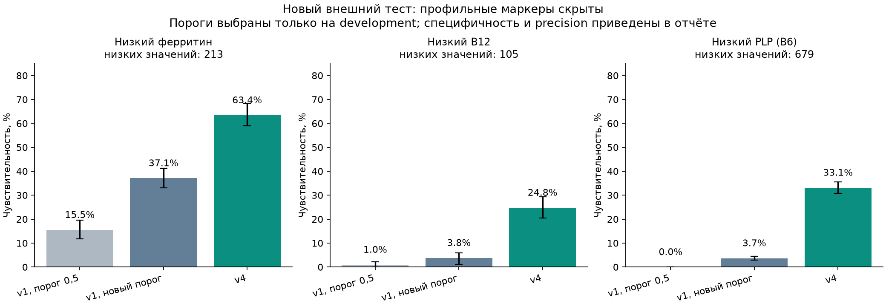

# v4: прогноз низких маркеров по неполным анализам

Дата: 2026-10-05. **Обучение и новый внешний тест завершены.**
На реальных NHANES данных улучшились прогнозы низкого ферритина и PLP при скрытой профильной панели.
B12 остаётся слабой задачей: precision 3,6% в расширенной панели, 2,4% по ОАК.
Веса и пороги выбраны до внешнего теста. Клинические головы/default backend v1 сохранены.
v4 — отдельная исследовательская семья `biochemical_v4`, не замена диагнозов/12 причин анемии.

## Почему изменена постановка

Внешняя проверка v1 показала слабое выявление низких маркеров при отсутствии профильных анализов.
В v4 обучаются цели `low_ferritin`, `low_B12`, `low_PLP` на известных положительных и отрицательных
измерениях реальных людей. Значение выше порога означает «маркер не низкий», не «клинического дефицита нет».
Пропуск эталонного маркера исключает запись для этой цели, не создаёт отрицательную метку.
Все клинические цели NHANES остаются неизвестными. Частично синтетические 840 записей кейса
не используются для fit новых голов; они лежат только за прежним фиксированным v1-компаратором.

Ориентиры: ферритин <15 мкг/л, B12 <200 пг/мл, HPLC PLP <20 нмоль/л.
Обоснование для биохимических ориентиров — [CDC Second Nutrition Report](https://stacks.cdc.gov/view/cdc/11790/cdc_11790_DS1.pdf);
лабораторные методы и условия применимости дополнительно проверены по компонентам.

## Development и закрытый тест

| Цель | Development | Новый внешний тест | Ограничение |
|---|---|---|---|
| low_ferritin | NHANES 2003–2004 + 2005–2006 | 2007–2008 | Только женщины 18–49 с известным измерением; мужчины/пожилые не проверены |
| low_B12 | NHANES 2011–2012 | 2013–2014 | Возраст ≥20; сопоставимый метод Roche, опубликованные поправленные значения LBDB12 в тесте |
| low_PLP | NHANES 2005–2006 | 2007–2008 | HPLC; энзиматический B6 2003–2004 исключён |

Прежний NHANES 2005–2006 после раскрытия результатов используется как development следующей версии,
а не повторно как её нетронутый тест. Новые тестовые таблицы нормализуются только после сохранения
selection и весов. Их файлы/методы и контрольные суммы закреплены в протоколе до fit.
Отдельные взрослые когорты после общего фильтра: 5981 в 2007–2008,
5768 в 2013–2014; задачи оцениваются на разных подмножествах с известным маркером.
Это не сумма независимых положительных пациентов по задачам: железо и PLP могут измеряться у одного человека.

Фильтр: ≥18 лет (B12≥20), известная беременность исключена, женщины 18–44 с неизвестной беременностью
исключены, для железа только F18–49. Для inference ≥5 поддержанных лабораторных показателей;
extended дополнительно требует хотя бы один поддержанный показатель биохимии.
Точные совпадения полного ОАК с development/кейсом и полные дубликаты в тесте — по 0.
Общего реестра личностей нет, проверка совпадений не доказывает отсутствие общих людей между источниками.
Возраст источника сохраняется, модельный age фиксированно ограничен 80 для сопоставимости top-coded циклов.
Вес WTMEC2YR/страты/PSU сохранён, benchmark невзвешенный, популяционная распространённость не оценивается.

Единицы: Hb/MCHC г/дл×10→г/л, CRP мг/дл×10→мг/л, остальные выбранные SI-поля импортированы документированно.
Использованы [ферритин 2007–2008](https://wwwn.cdc.gov/Nchs/Data/Nhanes/Public/2007/DataFiles/FERTIN_E.htm),
[PLP 2007–2008](https://wwwn.cdc.gov/Nchs/Data/Nhanes/Public/2007/DataFiles/VIT_B6_E.htm),
[B12 2013–2014](https://wwwn.cdc.gov/Nchs/Data/Nhanes/Public/2013/DataFiles/VITB12_H.htm).
У B12 используются уже исправленные CDC значения, без второй коррекции. CBC instrument MAXM→HMX
изменён между ранними циклами, методический сдвиг остаётся ограничением внешнего сравнения.
Фолат 2007–2008 имеет другой метод и не включался; медь/воспаление/12 этиологий в v4 не обучались.

## Модели, пропуски и выбор

Четыре фиксированные конфигурации: логистическая регрессия (C=0,5) с median+scale,
логистическая с дополнительными индикаторами пропусков, CatBoost 200 деревьев depth4,
CatBoost с копиями drop30 и ОАК. Параметры закреплены до обучения, подбора по внешнему тесту нет.
Копии добавляются только после разделения обучающих пациентов. Импутация/масштаб fit только на train.
Возраст/пол не маскируются; пропуски исходника сохраняются, target markers не восстанавливаются.

Для каждой из трёх целей две головы: CBC и extended. CBC — 11 демографических/ОАК признаков;
extended добавляет creatinine, albumin, LDH и CRP для железа/PLP. У B12 CRP не используется:
его нет в соответствующих сравниваемых компонентах. Все нутриентные и профильные маркеры,
MMA/гомоцистеин, идентификаторы, цикл, PSU/веса и диагнозы исключены из предикторов.
Это ограниченная первая версия; другие доступные анализы пока не используются, что явно учитывается в достаточности.

Пять development-fold с группировкой cycle/stratum/PSU; группы и пациенты train/valid не пересекаются.
Сравнение по среднему AP двух OOF-режимов (доступные предикторы и drop30), затем AUROC/log-loss.
OOF выбирает конфигурацию; порог — минимальный с specificity≥90% **в обоих** OOF-режимах.
Это инженерная исследовательская цель, не утверждённая медицинская граница.
Метрики development использованы для выбора и имеют оптимизм отбора; не называются независимой проверкой.
Валидационные fold-метрики порога также не являются полностью вложенной оценкой его выбора.
Независимость оценки новой версии обеспечивается последующим отдельным внешним тестом.
Нативные scores не проходили дополнительной калибровки и не являются подтверждёнными клиническими вероятностями.

| Цель / панель | Выбранная модель | Development n / positives | Порог v4 | Порог v1 tuned |
|---|---|---:|---:|---:|
| low_ferritin/extended | catboost_dropout | 2420 / 373 | 0.25895 | 0.21661 |
| low_ferritin/cbc | catboost_dropout | 2420 / 373 | 0.26953 | 0.38642 |
| low_B12/extended | logistic_mask | 4789 / 89 | 0.03187 | 0.12039 |
| low_B12/cbc | logistic_values | 4793 / 89 | 0.02924 | 0.17014 |
| low_PLP/extended | logistic_values | 4613 / 625 | 0.24300 | 0.00959 |
| low_PLP/cbc | catboost_dropout | 4617 / 625 | 0.24351 | 0.15405 |

Baseline v1 сравнивается на **тех же пациентах и предикторах**, с прежним порогом 0,5 и с порогами,
подобранными по тому же development-правилу. Внешний тест воспроизводит маршрут extended/CBC по пациенту,
включая смену маршрута после drop30. Case-головы v1 обучены на другой семантике меток; здесь проверяется
перенос их scores на низкий маркер, не клиническая истинность их исходных диагнозов.

Протокол frozen UTC `2026-10-04T21:48:27.748924+00:00`, SHA `512cee20da339a86ce06ed6b473207e5e9005adbcb435160d8067b1c3b50c2ef`.
Selection/веса locked UTC `2026-10-04T21:49:01.983968+00:00` до теста; SHA весов `59ffb63213b815500a1030408f9f1b07489625e39e1c81f5dfa1d9cde7b6836f`.
После теста веса и пороги не изменены. Показатели теперь открыты: дальнейшее улучшение этой версии
потребует следующего внешнего теста.

## Новый внешний тест: маркеры скрыты, доступны ОАК/поддержанная биохимия

| Цель | Модель | n / низкий маркер | F1 | Sensitivity | Specificity | Precision | AP | AUROC |
|---|---|---:|---:|---:|---:|---:|---:|---:|
| Низкий ферритин | v1_default | 1254 / 213 | 0.258 | 15.5% | 99.0% | 76.7% | 0.551 | 0.824 |
| Низкий ферритин | v1_tuned | 1254 / 213 | 0.467 | 37.1% | 95.6% | 63.2% | 0.551 | 0.824 |
| Низкий ферритин | v4 | 1254 / 213 | 0.616 | 63.4% | 91.4% | 60.0% | 0.670 | 0.871 |
| Низкий B12 | v1_default | 5215 / 105 | 0.017 | 1.0% | 99.8% | 9.1% | 0.022 | 0.515 |
| Низкий B12 | v1_tuned | 5215 / 105 | 0.019 | 3.8% | 93.7% | 1.2% | 0.022 | 0.515 |
| Низкий B12 | v4 | 5215 / 105 | 0.063 | 24.8% | 86.5% | 3.6% | 0.031 | 0.589 |
| Низкий PLP (B6) | v1_default | 5372 / 679 | 0.000 | 0.0% | 100.0% | не определён | 0.145 | 0.504 |
| Низкий PLP (B6) | v1_tuned | 5372 / 679 | 0.062 | 3.7% | 97.9% | 20.3% | 0.145 | 0.504 |
| Низкий PLP (B6) | v4 | 5372 / 679 | 0.331 | 33.1% | 90.3% | 33.1% | 0.322 | 0.758 |



Железо: sensitivity 15,5% у v1 default /37,1% у v1 tuned /63,4% у v4,
но specificity соответственно 99,0% /95,6% /91,4%. Есть компромисс: число положительных
прогнозов увеличивается. AP 0,551→0,670 и AUROC 0,824→0,871 относительно прежних scores
поддерживают улучшение ранжирования, а не только эффект смены порога.
Ферритин всё ещё пропущен у 78 из 213 низких значений; модель не заменяет измерение.

PLP: sensitivity 33,1%, specificity 90,3%, precision 33,1%; F1 0,331 против 0,062 у v1 tuned.
AP 0,145→0,322, AUROC 0,504→0,758. Улучшение существенное относительно прежней модели,
но 454 из 679 низких значений всё ещё пропущены.

B12: sensitivity 24,8%, specificity 86,5%, precision **3,6%** (26 true positives, 688 marker-relative false positives).
AUROC лишь 0,589, AP 0,031 при доле низких значений около 2%. Формальный критерий прироста
extended пройден, но абсолютное качество остаётся слабым и не даёт основания для уверенного клинического вывода.
CBC B12 не прошёл критерии прироста. Precision зависит от состава/доли положительных этой выборки;
она не переносится автоматически на клиническую популяцию.

## Только ОАК

| Цель | Модель | n / низкий маркер | F1 | Sensitivity | Specificity | Precision | AP | AUROC |
|---|---|---:|---:|---:|---:|---:|---:|---:|
| Низкий ферритин | v1_default | 1254 / 213 | 0.286 | 18.3% | 98.0% | 65.0% | 0.489 | 0.778 |
| Низкий ферритин | v1_tuned | 1254 / 213 | 0.412 | 31.0% | 96.1% | 61.7% | 0.489 | 0.778 |
| Низкий ферритин | v4 | 1254 / 213 | 0.594 | 61.5% | 90.7% | 57.5% | 0.630 | 0.862 |
| Низкий B12 | v1_default | 5215 / 105 | 0.016 | 1.0% | 99.6% | 4.5% | 0.027 | 0.525 |
| Низкий B12 | v1_tuned | 5215 / 105 | 0.032 | 9.5% | 90.0% | 1.9% | 0.027 | 0.525 |
| Низкий B12 | v4 | 5215 / 105 | 0.041 | 13.3% | 88.9% | 2.4% | 0.031 | 0.566 |
| Низкий PLP (B6) | v1_default | 5375 / 679 | 0.037 | 2.1% | 98.8% | 19.7% | 0.153 | 0.531 |
| Низкий PLP (B6) | v1_tuned | 5375 / 679 | 0.088 | 5.4% | 97.4% | 23.3% | 0.153 | 0.531 |
| Низкий PLP (B6) | v4 | 5375 / 679 | 0.276 | 28.0% | 89.1% | 27.1% | 0.231 | 0.690 |

## Дополнительно скрыты 30% реально измеренных предикторов

| Цель | Модель | n / низкий маркер | F1 | Sensitivity | Specificity | Precision | AP | AUROC |
|---|---|---:|---:|---:|---:|---:|---:|---:|
| Низкий ферритин | v1_default | 1254 / 213 | 0.214 | 12.7% | 98.8% | 69.2% | 0.468 | 0.780 |
| Низкий ферритин | v1_tuned | 1254 / 213 | 0.450 | 39.4% | 92.7% | 52.5% | 0.468 | 0.780 |
| Низкий ферритин | v4 | 1254 / 213 | 0.580 | 62.9% | 89.0% | 53.8% | 0.611 | 0.842 |
| Низкий B12 | v1_default | 5215 / 105 | 0.000 | 0.0% | 99.8% | 0.0% | 0.024 | 0.561 |
| Низкий B12 | v1_tuned | 5215 / 105 | 0.037 | 11.4% | 89.5% | 2.2% | 0.024 | 0.561 |
| Низкий B12 | v4 | 5215 / 105 | 0.053 | 7.6% | 96.3% | 4.0% | 0.026 | 0.519 |
| Низкий PLP (B6) | v1_default | 5372 / 679 | 0.000 | 0.0% | 100.0% | не определён | 0.137 | 0.516 |
| Низкий PLP (B6) | v1_tuned | 5372 / 679 | 0.121 | 10.6% | 90.6% | 14.0% | 0.137 | 0.516 |
| Низкий PLP (B6) | v4 | 5372 / 679 | 0.285 | 25.2% | 92.6% | 32.9% | 0.276 | 0.723 |

Для железа F1 остаётся 0,580, PLP 0,285. Для B12 sensitivity снижается до 7,6%;
низкая чувствительность/слабое ранжирование сохраняются. Минимальный ввод 5 labs — техническое
ограничение исследования, не доказательство достаточности такого набора анализов.

## Проверки прироста и решение

До теста: ≥30 positives, specificity≥85%, прирост F1≥0,02 относительно v1 tuned,
нижняя граница парного 95% интервала прироста sensitivity >0; extended дополнительно
не должен проиграть v1 tuned по F1 drop30 более чем на 0,02.
Интервалы приблизительные: 500 bootstrap PSU внутри страт, невзвешенные, без поправки на множественные сравнения.
Сравнение sensitivity при разных specificity не заменяет сравнение при клинически согласованной стоимости ошибок;
AP/AUROC и абсолютные числа ошибок приведены дополнительно.

| Голова | Критерий улучшения | Парный 95% интервал прироста sensitivity относительно v1 tuned |
|---|---|---:|
| low_ferritin/extended | Пройден | +21.8% … +30.5% |
| low_ferritin/cbc | Пройден | +25.9% … +35.2% |
| low_B12/extended | Пройден | +16.8% … +25.3% |
| low_B12/cbc | Не пройден: F1_gain_vs_tuned, paired_sensitivity_gain | -1.1% … +8.7% |
| low_PLP/extended | Пройден | +27.6% … +31.8% |
| low_PLP/cbc | Пройден | +20.2% … +25.2% |

Пять из шести голов прошли **исследовательский критерий прироста**, не клиническую приёмку.
Критерий допускает слабое абсолютное качество B12; этот результат явно раскрыт и не используется для
переименования низкого маркера в диагноз. Ни одна из 12 причин анемии не валидирована этой серией.
Default клинические case-головы v1 в backend не заменены. Порог v1_tuned используется только
как экспериментальный компаратор и не перенесён в клинический backend.

## Локальный запуск v4

Синтетический пример без профильных маркеров:

```bash
.venv/bin/python -m ml_baselines.biochemical_predict --input examples/biochemical_v4_input.json --pregnancy not_pregnant
```

`load_candidate` проверяет отдельный `backend/data/biochemical_model_trust.json` до joblib-load,
SHA весов и внешней evidence-sidecar, единицы/схему/тип голов и конечность порогов.
Этот реестр не делает v4 допустимым clinical bundle для ModelService.
Ответ содержит low_ferritin/low_B12/low_PLP, research_score, пороги, маршрут и external_gate_passed;
`clinicalValidated=false`. При известном маркере его фактический статус выводится отдельно,
но численный прогноз намеренно остаётся полученным без маркера.
Для женщин 18–44 неизвестная pregnancy приводит к отказу; известная беременность исключена,
для железа мужчины/возраст>49 исключены; <5 поддержанных labs — недостаточно данных.
Работающий сайт/API сохраняют прежнюю модель; интерфейс/фразы не переключены на биохимические scores.

Воспроизведение обучения (новый каталог):

```bash
.venv/bin/python scripts/fetch_nhanes_v4.py
.venv/bin/python -m ml_baselines.train_biochemical freeze --output experiments/NEW_V4
.venv/bin/python -m ml_baselines.train_biochemical train --output experiments/NEW_V4
.venv/bin/python -m ml_baselines.train_biochemical evaluate --output experiments/NEW_V4
MPLCONFIGDIR=/private/tmp/hema-v4-mpl .venv/bin/python -m ml_baselines.biochemical_report --output experiments/NEW_V4
.venv/bin/python -m unittest discover -s tests -p test_biochemical_v4.py -v
```

Прежние результаты/исходники не перезаписываются. Для нового runtime-bundle нужна отдельная явная регистрация
его hash/evidence, как для прежних весов. Открытые NHANES ID/значения не являются данными пользователей сервиса.

Артефакты: protocol+snapshot, selection+lock, 30 групповых split-audit, OOF NPZ, development/fold metrics,
test features/metadata/audit/manifest, 27 строк external_metrics, individual predictions/subgroups,
external_gates/release_decision, weights, график и контрольные суммы. Проверки текущей реализации — `verification.json`.
