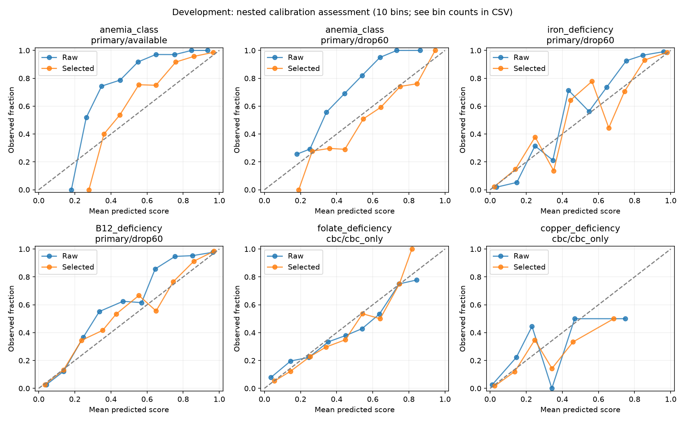

# Калибровка Hema и перенос внешних меток: calibrated_v3

Обучены калибраторы текущего baseline_v1. Внешние данные проверены отдельным опытом, в калибровку они не входят.
По development выбраны 10 преобразований из 14: 6 primary и 4 ОАК. Остальные оценки сохранены исходными.
Поэтому статус набора **partial**, `calibrationApplied=true`, общий `calibrated=false`; применённый метод виден для каждой задачи/панели.
Это калибровка по частично синтетическим меткам кейса, не подтверждение клинических вероятностей.

## Протокол

- Замороженные 672 development / 168 holdout и пять внешних фолдов baseline_v1. Базовые алгоритмы/гиперпараметры не менялись.
- Внутри train каждого внешнего фолда ещё три фолда по пациентам, стратифицированные по anemia_class. На их OOF обучается калибратор; оценка — только на внешнем validation. Все копии пациента после удаления анализов остаются в его train. Нет обучения калибратора на предсказаниях для пациентов, использованных соответствующей базовой моделью. `split_audit.json` хранит все 210 внутренних разбиений.
- Primary: available/drop30/drop60, равный общий вес каждого пациента, по 1/3 для представления. ОАК: cbc_only. Механизм удаления анализов фиксирован; калибровка не переносится автоматически на любой клинический механизм пропусков.
- Сравнение identity / temperature, для бинарных задач также монотонный sigmoid от logit(score). Слабая регуляризация к identity, slope>0. Temperature сохраняет argmax и бинарный порог 0,5. Isotonic не использован при малом числе положительных.
- Выбор: снижение среднего log loss ≥2%, рост Brier ≤0,001, ECE ≤0,01, падение F1 в любом сценарии отбора ≤0,02. Порог решений 0,5 не подбирался. Критерии записаны до обучения в manifest.json; calibration_selection.json — до holdout.
- Финальные калибраторы fit на пятифолдовых OOF 672 development-пациентов, затем применяются к прежним базовым весам на всех 672. Это схема с одним финальным базовым estimator; распределение scores при меньшем inner-train может отличаться от финального.
- Известный нормальный Hb по-прежнему обнуляет воспалительную анемию после преобразования. Новых диагностических правил или Hb-conditioning 12 классов не добавлено.
- Внешняя оценка калибратора отделена от его fit, но исходный выбор базовых алгоритмов v1 и выбор метода уже использовали development. Оценка выбранного метода по тем же фолдам содержит оптимизм. Holdout открыт ранее и здесь повторный; он не независимая новая когорта. Значения не являются обещанием качества на реальных пациентах.

## Выбранные методы

| target | primary | cbc |
| --- | --- | --- |
| anemia_class | temperature | identity |
| iron_deficiency | sigmoid_logit | identity |
| B12_deficiency | sigmoid_logit | identity |
| folate_deficiency | identity | temperature |
| B6_deficiency | sigmoid_logit | temperature |
| copper_deficiency | sigmoid_logit | temperature |
| inflammation_anemia | sigmoid_logit | temperature |

## Исходная панель: nested development

| target | route | scenario | raw_log_loss | selected_log_loss | raw_brier | selected_brier | raw_ece_10 | selected_ece_10 | raw_f1 | selected_f1 |
| --- | --- | --- | --- | --- | --- | --- | --- | --- | --- | --- |
| anemia_class | primary | available | 0.662 | 0.411 | 0.296 | 0.197 | 0.279 | 0.079 | 0.868 | 0.868 |
| iron_deficiency | primary | available | 0.055 | 0.049 | 0.012 | 0.011 | 0.020 | 0.009 | 0.981 | 0.981 |
| B12_deficiency | primary | available | 0.077 | 0.074 | 0.019 | 0.018 | 0.029 | 0.023 | 0.961 | 0.956 |
| folate_deficiency | primary | available | 0.171 | 0.171 | 0.049 | 0.049 | 0.032 | 0.032 | 0.785 | 0.785 |
| B6_deficiency | primary | available | 0.059 | 0.057 | 0.011 | 0.011 | 0.012 | 0.009 | 0.857 | 0.840 |
| copper_deficiency | primary | available | 0.023 | 0.023 | 0.006 | 0.006 | 0.008 | 0.011 | 0.902 | 0.923 |
| inflammation_anemia | primary | available | 0.023 | 0.023 | 0.006 | 0.006 | 0.008 | 0.008 | 0.951 | 0.962 |

## Исходная панель: повторный holdout

| target | route | scenario | raw_log_loss | selected_log_loss | raw_brier | selected_brier | raw_ece_10 | selected_ece_10 | raw_f1 | selected_f1 |
| --- | --- | --- | --- | --- | --- | --- | --- | --- | --- | --- |
| anemia_class | primary | available | 0.609 | 0.396 | 0.274 | 0.191 | 0.260 | 0.061 | 0.903 | 0.903 |
| iron_deficiency | primary | available | 0.047 | 0.045 | 0.012 | 0.013 | 0.022 | 0.013 | 0.974 | 0.974 |
| B12_deficiency | primary | available | 0.029 | 0.021 | 0.005 | 0.005 | 0.020 | 0.017 | 0.986 | 0.971 |
| folate_deficiency | primary | available | 0.221 | 0.221 | 0.067 | 0.067 | 0.050 | 0.050 | 0.727 | 0.727 |
| B6_deficiency | primary | available | 0.044 | 0.044 | 0.006 | 0.007 | 0.005 | 0.009 | 0.923 | 0.923 |
| copper_deficiency | primary | available | 0.054 | 0.045 | 0.012 | 0.011 | 0.014 | 0.011 | 0.833 | 0.833 |
| inflammation_anemia | primary | available | 0.008 | 0.006 | 0.001 | 0.001 | 0.007 | 0.006 | 1.000 | 1.000 |

## Пропуски и ОАК: повторный holdout

| target | route | scenario | raw_log_loss | selected_log_loss | raw_brier | selected_brier | raw_ece_10 | selected_ece_10 | raw_f1 | selected_f1 |
| --- | --- | --- | --- | --- | --- | --- | --- | --- | --- | --- |
| anemia_class | primary | drop60 | 1.617 | 1.533 | 0.682 | 0.656 | 0.135 | 0.097 | 0.437 | 0.437 |
| anemia_class | cbc | cbc_only | 1.138 | 1.138 | 0.555 | 0.555 | 0.054 | 0.054 | 0.467 | 0.467 |
| iron_deficiency | primary | drop60 | 0.193 | 0.169 | 0.055 | 0.050 | 0.062 | 0.027 | 0.895 | 0.895 |
| iron_deficiency | cbc | cbc_only | 0.348 | 0.348 | 0.109 | 0.109 | 0.061 | 0.061 | 0.800 | 0.800 |
| B12_deficiency | primary | drop60 | 0.189 | 0.175 | 0.053 | 0.052 | 0.048 | 0.041 | 0.794 | 0.824 |
| B12_deficiency | cbc | cbc_only | 0.329 | 0.329 | 0.104 | 0.104 | 0.057 | 0.057 | 0.615 | 0.615 |
| folate_deficiency | primary | drop60 | 0.400 | 0.400 | 0.127 | 0.127 | 0.067 | 0.067 | 0.200 | 0.200 |
| folate_deficiency | cbc | cbc_only | 0.477 | 0.452 | 0.153 | 0.147 | 0.102 | 0.040 | 0.217 | 0.217 |
| B6_deficiency | primary | drop60 | 0.121 | 0.116 | 0.024 | 0.024 | 0.012 | 0.008 | 0.600 | 0.600 |
| B6_deficiency | cbc | cbc_only | 0.141 | 0.132 | 0.034 | 0.034 | 0.031 | 0.022 | 0.250 | 0.250 |
| copper_deficiency | primary | drop60 | 0.163 | 0.140 | 0.025 | 0.025 | 0.021 | 0.017 | 0.600 | 0.600 |
| copper_deficiency | cbc | cbc_only | 0.184 | 0.166 | 0.041 | 0.041 | 0.039 | 0.041 | 0.000 | 0.000 |
| inflammation_anemia | primary | drop60 | 0.089 | 0.086 | 0.025 | 0.024 | 0.017 | 0.020 | 0.762 | 0.783 |
| inflammation_anemia | cbc | cbc_only | 0.164 | 0.160 | 0.051 | 0.050 | 0.041 | 0.060 | 0.522 | 0.522 |

Log loss и Brier измеряют качество вероятностных предсказаний, объединяя различение и калибровку; снижение одного показателя не доказывает калибровку само по себе. ECE здесь 10 равных интервалов: для бинарных целей положительная вероятность, для multiclass максимальная оценка против правильности argmax. `reliability_bins.csv` содержит число записей в каждом интервале; ECE зависит от разбиения и особенно нестабилен для редких целей. Brier: бинарный стандартный, multiclass сумма ошибок по 12 классам — между ними значения не сравниваются.

На holdout B6/медь всего по 7 положительных; на development по 28. Даже улучшение log loss не устраняет отсутствие анализов и не подтверждает выявление редких дефицитов по ОАК. F1 меди по ОАК на повторном holdout остаётся 0.

## Что происходит с решениями API

Сохранённые OOF/test scores воспроизведены через текущие политики `ModelService` и полноты ввода с реальной маршрутизацией. При отсутствии возраста/пола/Hb запрос исключён из eligible_n; ОАК определяется по введённым лабораторным признакам. `coverage` — доля выданных причинных выводов среди допустимых вводов, `accepted_class_accuracy` — совпадение с CSV только среди них. Это не клиническая точность и не полнота выявления. Более резкие оценки способны увеличить coverage при прежнем пороге 0,5, поэтому этот слой оценивается отдельно.

| version | partition | scenario | eligible_n | evaluated_n | coverage | accepted_class_accuracy |
| --- | --- | --- | --- | --- | --- | --- |
| baseline_v1 | nested_development_oof | available | 672 | 323 | 0.481 | 0.988 |
| calibrated_v3 | nested_development_oof | available | 672 | 423 | 0.629 | 0.976 |
| baseline_v1 | nested_development_oof | drop60 | 255 | 19 | 0.075 | 0.947 |
| calibrated_v3 | nested_development_oof | drop60 | 255 | 68 | 0.267 | 0.853 |
| baseline_v1 | nested_development_oof | cbc_only | 672 | 170 | 0.253 | 0.712 |
| calibrated_v3 | nested_development_oof | cbc_only | 672 | 170 | 0.253 | 0.712 |
| baseline_v1 | reused_holdout | available | 168 | 94 | 0.560 | 0.968 |
| calibrated_v3 | reused_holdout | available | 168 | 115 | 0.685 | 0.939 |
| baseline_v1 | reused_holdout | drop60 | 74 | 3 | 0.041 | 1.000 |
| calibrated_v3 | reused_holdout | drop60 | 74 | 19 | 0.257 | 0.789 |
| baseline_v1 | reused_holdout | cbc_only | 168 | 45 | 0.268 | 0.778 |
| calibrated_v3 | reused_holdout | cbc_only | 168 | 45 | 0.268 | 0.778 |

## Внешнее дообучение: Kılıçarslan

Источник: Serhat Kılıçarslan, Mete Celik, Safak Şahin, Mendeley DOI 10.17632/dt89jydgnv.1, CC BY 4.0. Использована подготовленная копия `case_units_verified_source_partial.csv`: 10 документированных признаков, Hb/MCHC ×10, serum iron ×0,1791; неподтверждённые B12/RBC/WBC/пол/TIBC/TSAT не импортированы. Возраст источника неизвестен, метод/популяция отличаются от кейса. Единицы сами по себе не устанавливают эквивалентность методов.

Только положительные исходные метки классов 2/4/3 → iron/B12/folate. Нули one-hot не перенесены. Неизвестные цели исключены из loss соответствующей задачи. Исходные классы приоритетны и скрывают сочетания; эти слабые положительные метки не равны подтверждённым независимым диагнозам. Multiclass, B6/медь/воспаление не обучались на источнике.

Сохранённые QC-флаги временно исключены из опыта, группы повторных полных векторов дедуплицированы; оригиналы не изменены. По задачам использованы 4152 / 195 / 150 положительных записей. Нет внешних отрицательных примеров; это может смещать априорную вероятность. Суммарный вес внешних данных =10% case-train, без ручного подбора по holdout. У аугментированных копий сохраняется отношение весов. Для всех пяти фолдов те же case-train/validation и базовый алгоритм; источник никогда не используется для калибратора.

Критерий замены: средний F1 трёх сценариев ≥+0,01, падение в любом сценарии ≤0,02, рост Brier ≤0,001. Все три задачи **не прошли** его. На повторном holdout фолаты улучшились, но этот результат не переопределяет прежний development-выбор. Внешние веса сохранены только для дальнейших опытов (`models/external_partial.joblib`), API их не принимает как поддержанное семейство. Нет независимой оценки качества на внешних диагнозах или циклах.

| target | method | log_loss | brier | f1 |
| --- | --- | --- | --- | --- |
| B12_deficiency | case_only | 0.158 | 0.044 | 0.861 |
| B12_deficiency | external_partial | 0.162 | 0.045 | 0.859 |
| folate_deficiency | case_only | 0.249 | 0.073 | 0.658 |
| folate_deficiency | external_partial | 0.247 | 0.072 | 0.649 |
| iron_deficiency | case_only | 0.131 | 0.035 | 0.933 |
| iron_deficiency | external_partial | 0.128 | 0.035 | 0.933 |

## NHANES: подготовленные единицы и маски

`scripts/prepare_nhanes.py` создал `data/external/processed/nhanes_case_units_v1/`: 5351 взрослый 2003–2004 (25 признаков) и 5807 взрослых 2011–2012 (18), исключена известная беременность, неизвестная отмечена. ID = цикл + SEQN, соединения один-к-одному. Hb/MCHC г/дл→г/л ×10; CRP 2003 мг/дл→мг/л ×10; MMA 2011 нмоль/л→мкмоль/л ×0,001. Пропуски сохраняются, общий билирубин не становится непрямым. Сохранены веса/страты/PSU, коды LOD, ограничения методов и ограниченный сверху возраст. Подсчёты невзвешенные.

Все десять целей кейса неизвестны и имеют loss-mask 0. Отдельно рассчитан только `anemia_by_case_rule`, без утверждения причины. Биомаркеры не превращены в подтверждённые дефициты или отрицательные диагнозы. B6 2003 не допускается к автоматическому объединению из-за документированного сдвига метода. NHANES готов для анализа распределений и разработки отдельных биомаркерных задач; клиническую калибровку нашего multiclass выполнить по этим файлам нельзя.

## Подключение и следующий этап

Набор `models/selected.joblib` содержит прежние базовые модели и 14 сохранённых калибраторов (4 identity). API умеет применять их в обеих панелях и возвращает методы/границы калибровки. `calibrationApplied=true` не означает клиническую валидацию; `calibrated=false` честно отражает сохранённые сырые головы. По заранее записанной политике promotion требует новой независимой размеченной выборки, поэтому default baseline_v1 сохранён; v3 доступен как отдельный исследовательский кандидат. Отказы при малом вводе и правила рекомендаций сохраняются.

Для следующей итерации нужны подтверждение единиц/методов B12 источника, независимые положительные и отрицательные диагнозы с масками неизвестности, метки B6/меди и новая когорта проверки. Затем сравнить отдельное биомаркерное предобучение/источник с учётом доменного сдвига, калибровку на реальной целевой популяции и качество среди новых выданных выводов.

Воспроизведение: `.venv/bin/python -m ml_baselines.calibrate --output experiments/NEW_NAME`, затем `.venv/bin/python -m ml_baselines.calibration_report --output experiments/NEW_NAME`. Нормализация NHANES: `.venv/bin/python scripts/prepare_nhanes.py` (не перезаписывает предыдущие производные). Весовой bundle joblib загружается только из доверенного локального источника.

Методическая документация: [scikit-learn probability calibration](https://scikit-learn.org/stable/modules/calibration.html). Документация CDC и атрибуция исходников находятся в unit_mapping.json, manifest.json и EXTERNAL_DATASETS.md.
