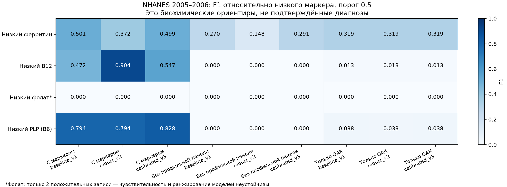

# Независимая внешняя проверка: исследовательская версия

Дата: 2026-10-05. Проверка завершена; **клиническая финализация не подтверждена**.
Зафиксированный champion — `baseline_v1`, кандидаты `robust_v2` и `calibrated_v3` оценены для сравнения.
Default, веса, калибраторы и порог 0,5 сохранены. Ни одна модель не обучалась на участниках этого цикла NHANES.
Новая выборка не входит в 840 записей кейса; её результаты ранее не использовались для выбора моделей.
Результаты теперь открыты: любые дальнейшие изменения с учётом этой проверки требуют новой проверочной выборки.

## Что и как проверено

Официальный [NHANES 2005–2006](https://wwwn.cdc.gov/Nchs/Nhanes/Search/DataPage.aspx?Component=Laboratory&Cycle=2005-2006):
10,348 участников, 5,563 взрослых. После исключения 365 взрослых с известной беременностью
и 111 женщин 18–44 лет с неизвестным статусом осталось **5,087 человек**.
Возраст 85+ сохранён как top-coded, не восстановлен по среднему. Соединения компонентов по SEQN один-к-одному.
Дубликаты полных векторов и точные совпадения полного ОАК с данными кейса: по 0. Это проверка совпадений,
а не подтверждение личности: общий реестр пациентов отсутствует. Исходные файлы не изменялись.

24 признака имеют документированные отображения; все отсутствующие показатели остаются NaN.
Hb и MCHC г/дл ×10 → г/л, CRP мг/дл ×10 → мг/л; ферритин мкг/л, B12 пг/мл,
сывороточный фолат нг/мл и сывороточный PLP нмоль/л импортируются без изменения числа.
Нет замены общего билирубина непрямым, нет подстановки RBC-фолата вместо сывороточного, нет расчёта отсутствующего MMA.
Методы B12/фолата — Bio-Rad, PLP — HPLC. Единицы совпадают с кейсом, но метод анализов в исходном кейсе неизвестен.

Протокол и код сохранены **до вычисления предсказаний**, время — `2026-10-04T21:18:02.720406+00:00`,
SHA-256 протокола — `9c739d0b54d3dac829868c583439561148db8f4fbaa16ba7351e87a2b877af42`. Хеши доверенных весов проверяются до joblib-десериализации.
Подбор порогов, калибровка, импутация по внешней выборке и обучение отсутствуют.

Биохимические ориентиры из [CDC Second Nutrition Report (2012)](https://stacks.cdc.gov/view/cdc/11790/cdc_11790_DS1.pdf):
ферритин <15 мкг/л, B12 <200 пг/мл, фолат Bio-Rad <2 нг/мл, PLP HPLC <20 нмоль/л.
Их названия отделены от целей кейса: `low_ferritin`, `low_B12`, `low_folate`, `low_PLP`.
Пропуск маркера означает неизвестный ориентир, а не отрицательную метку; значение выше порога означает
«маркер не низкий», а не «дефицита нет». Все клинические метки сохранены пустыми, маски известных целей — 0.
Низкий маркер не определяет причину анемии и не исключает смешанные состояния или воспаление.
Взрослый ферритин в этом цикле измерялся **только у женщин 12–49 лет** — у нас взрослая подгруппа 18–49;
результаты железа нельзя распространить на мужчин и пожилых. См. [FERTIN_D](https://wwwn.cdc.gov/Nchs/Data/Nhanes/Public/2005/DataFiles/FERTIN_D.htm).

Главный режим — **без профильной панели**: после создания эталонного ориентира из входа удаляются все показатели
соответствующего `PANELS`, включая MMA/гомоцистеин для B12 и гомоцистеин для фолата.
Дополнительно проверены доступные показатели с включённым маркером и только ОАК.
В каждом режиме нужно ≥5 измеренных лабораторных показателей; числа исключений сохранены.
Маршрут primary/CBC выбирается для каждого пациента так же, как в `predict(auto)`.
Это оценка численных ML-голов; отдельные причины отказа интерфейса/вердикта не считаются диагностическими метками.

Метрики невзвешенные, отражают этот benchmark, не популяционную распространённость.
WTMEC2YR, страты и PSU сохранены; приближённые 95% интервалы F1/sensitivity/specificity/precision —
500 повторов bootstrap PSU внутри страт, с сохранением кластеров. AUC/AP без интервалов.
Пустой precision — нет положительных прогнозов; не подменяется 0.
При нулевых истинноположительных прогнозах bootstrap может дать [0,0]: это свойство текущей выборки,
а не доказательство точного нулевого значения на будущих пациентах. Редкие положительные подгруппы отдельно отмечены.
Brier/log-loss/ECE сравнивают scores с **биохимическим ориентиром**; они не подтверждают калибровку клинических вероятностей.

## Основной результат baseline_v1: профильная панель скрыта

| Биохимический ориентир | n / низкий маркер | F1 | Чувствительность | Специфичность | Precision |
|---|---:|---:|---:|---:|---:|
| Низкий ферритин | 1,233 / 196 | 0.270 | 16.3% | 99.1% | 0.780 |
| Низкий B12 | 4,533 / 130 | 0.000 | 0.0% | 99.8% | 0.000 |
| Низкий фолат* | 4,595 / 2 | 0.000 | 0.0% | 99.9% | 0.000 |
| Низкий PLP (B6) | 4,629 / 625 | 0.000 | 0.0% | 100.0% | не определён |

Ферритин: 32 из 196 низких значений обнаружены, 164 пропущены относительно ориентира;
F1 0,270 (приближённый 95% интервал 0,218–0,314), sensitivity 16,3% (12,7–19,6%).
B12: 0 из 130; PLP: 0 из 625. Это не проверка всех клинических дефицитов, но она
**не поддерживает обещание надёжного выявления соответствующих низких маркеров без профильных анализов**.
Для фолата всего 2 положительных записи; вывод о переносимости/превосходстве какой-либо модели невозможен.

## Дополнительный режим: только ОАК

| Биохимический ориентир | n / низкий маркер | F1 | Чувствительность | Специфичность | Precision |
|---|---:|---:|---:|---:|---:|
| Низкий ферритин | 1,230 / 196 | 0.319 | 20.9% | 98.1% | 0.672 |
| Низкий B12 | 4,521 / 130 | 0.013 | 0.8% | 99.4% | 0.034 |
| Низкий фолат* | 4,583 / 2 | 0.000 | 0.0% | 98.9% | 0.000 |
| Низкий PLP (B6) | 4,617 / 625 | 0.038 | 2.1% | 98.8% | 0.217 |

Высокая специфичность при почти нулевой чувствительности не означает хорошее обнаружение дефицита.
Подгруппы по полу, возрасту и статусу Hb доступны в `subgroup_metrics.csv`; у железа мужская подгруппа отсутствует.
У фолата и некоторых подгрупп слишком мало положительных записей для надёжных сравнений.

## Дополнительный режим: определяющий маркер доступен модели

| Биохимический ориентир | n / низкий маркер | F1 | Чувствительность | Специфичность | Precision |
|---|---:|---:|---:|---:|---:|
| Низкий ферритин | 1,233 / 196 | 0.501 | 88.3% | 68.9% | 0.349 |
| Низкий B12 | 4,534 / 130 | 0.472 | 32.3% | 99.9% | 0.875 |
| Низкий фолат* | 4,596 / 2 | 0.000 | 0.0% | 99.6% | 0.000 |
| Низкий PLP (B6) | 4,630 / 625 | 0.794 | 80.2% | 96.6% | 0.786 |

PLP F1 0,794 у v1 и 0,828 у v3, но модель получает сам маркер, определяющий ориентир.
Такая согласованность полезна для проверки импорта/поведения, однако содержит incorporation bias.
Расхождение ML-оценки железа с ферритином ≥15 нельзя назвать ложным клиническим диагнозом:
модель кейса учитывает и другие железные показатели, а proxy имеет более узкий смысл.

## Сравнение всех трёх зафиксированных моделей

| Модель | Вход | Ферритин F1 | B12 F1 | Фолат F1* | PLP F1 |
|---|---|---:|---:|---:|---:|
| baseline_v1 | С маркером | 0.501 | 0.472 | 0.000 | 0.794 |
| baseline_v1 | Без профильной панели | 0.270 | 0.000 | 0.000 | 0.000 |
| baseline_v1 | Только ОАК | 0.319 | 0.013 | 0.000 | 0.038 |
| robust_v2 | С маркером | 0.372 | 0.904 | 0.000 | 0.794 |
| robust_v2 | Без профильной панели | 0.148 | 0.000 | 0.000 | 0.000 |
| robust_v2 | Только ОАК | 0.319 | 0.013 | 0.000 | 0.033 |
| calibrated_v3 | С маркером | 0.499 | 0.547 | 0.000 | 0.828 |
| calibrated_v3 | Без профильной панели | 0.291 | 0.000 | 0.000 | 0.000 |
| calibrated_v3 | Только ОАК | 0.319 | 0.013 | 0.000 | 0.038 |



Калибровка на данных кейса не устранила падение при отсутствии панелей. У v2 высокий F1 B12
с известным B12 (0,904), однако без панели F1 остаётся 0. Этот результат не даёт основания
выбирать v2 для неполных анализов или объявлять её клинически проверенной.
Сравнение с постоянным prior из **672 обучающих пациентов кейса** есть в metrics.csv.
Для ферритина у v1 Brier без панели 0,115; для PLP 0,134 — почти всегда низкие scores.
Распределения существенно различаются: медиана Hb 111,7 г/л в кейсе против 144,0 здесь,
B12 307 против 478,5 пг/мл; подробности в `distribution_shift.csv`.
Разницу могут объяснять состав участников, искусственность исходной выборки, лабораторные методы,
процесс назначения анализов и разный смысл меток; причинное объяснение из этих данных не установлено.

## Решение по релизу

Исследовательский champion `baseline_v1` остаётся в backend. Это сохранение зафиксированного состояния,
**а не утверждение его внешней клинической достоверности**. Ни одну из трёх моделей нельзя финализировать
как надёжную модель 12 причин анемии на основании этой проверки; число независимо проверенных причин — 0/12.
`clinicalValidated=false`, `independentClinicalValidation=false`, `weights_changed=false`.
Не использовать низкий score как исключение дефицита при отсутствующих профильных анализах.
Внешние клинические метки меди и воспалительной анемии здесь отсутствуют и не создавались.

Обоснованный следующий исследовательский шаг — разделить обнаружение измеренного низкого маркера
и прогноз при отсутствующем маркере; для второго нужны дополнительные реальные обучающие пациенты
и отдельный следующий внешний тест. Это предложение, а не выполненное переобучение.
Для врачебной валидации подготовлен `docs/INDEPENDENT_VALIDATION.md` с условиями независимости
и шаблоном adjudication; пользователь подтвердил, что сейчас доступны только открытые данные.

## Воспроизведение и артефакты

```bash
.venv/bin/python scripts/fetch_nhanes_validation.py
.venv/bin/python -m ml_baselines.external_validate freeze --output experiments/external_validation_reproduction
.venv/bin/python -m ml_baselines.external_validate evaluate --output experiments/external_validation_reproduction
MPLCONFIGDIR=/private/tmp/hema-validation-mpl .venv/bin/python -m ml_baselines.external_validation_report --output experiments/external_validation_reproduction
.venv/bin/python -m unittest discover -s tests -p test_external_validation.py -v
```

Старый каталог результатов нельзя перезаписывать; fetch сохраняет существующие исходники.
`protocol.json`/`protocol.sha256` — правила и веса до проверки, `source_snapshot/` — выполнявшийся код,
`cohort_manifest.json`/`cohort_audit.csv` — источник/исключения/хеши,
`features.csv` — 37 входов в единицах кейса с NaN,
`biochemical_references.csv` — отдельные ориентиры,
`clinical_labels_unknown.csv` — неизвестные клинические цели с масками,
`predictions.csv` — индивидуальные scores, `metrics.csv` — 48 итоговых строк,
`subgroup_metrics.csv` — подгруппы, `distribution_shift.csv` — сдвиг данных,
`release_decision.json` — решение, `artifact_hashes.json` — контрольные суммы.
Открытые NHANES значения не являются данными пользователей сервиса.
