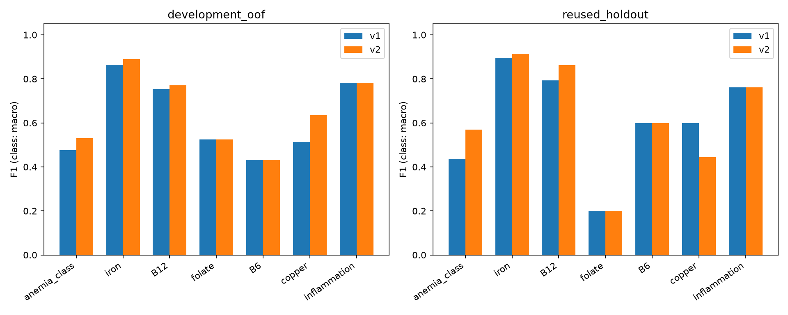

# Вторая серия моделей Hema: robust_v2

Выбор зафиксирован по development до повторной проверки holdout. Исходные данные и v1 не изменены.

## Метод и границы выводов

- Те же 672 development-пациента, 168 holdout и пять разбиений из baseline_v1. На holdout модели, preprocessing, веса классов и пороги не обучались.
- Шесть новых конфигураций: CatBoost/Extra Trees с пятью представлениями обучающих пациентов, умеренными весами классов sqrt(inverse frequency), вычисляемыми признаками и узкими панелями. Медианы/маски fit только на train. Возраст, пол, Hb-margin, логарифмы и отношения вычисляются только из входных значений; разметка не входит в X. Пропуски не превращаются в нули.
- Дополнительный кандидат для 12 классов: обнуление несовместимых с известным статусом Hb классов и нормализация. B6/медь остаются допустимыми при обоих статусах, неизвестные Hb/пол не ограничивают классы. Это согласование со смыслом кейсовой разметки, не новая клиническая вероятность и не подтверждение отсутствия дефицитов. Смешанные дефициты без анемии сохраняются как бинарные гипотезы; отдельного класса для них в CSV нет.
- Сравниваются новые и старые кандидаты. Primary: средний F1 available/drop30/drop60, CBC: F1 cbc_only. Замена требует +0,01 CV F1, падение F1 исходной панели не более 0,02, precision не более 0,10 и specificity не более 0,02 для бинарных целей. Иначе сохраняется v1. Все пороги решений 0,5; калибровка не выполнялась.
- Выбор и отчёт на одних OOF означают оптимизм оценки победителя. Holdout уже был открыт в v1; его повторное использование **не является новой независимой валидацией**. Для итогового качества нужна новая реальная когорта. Внешние наборы с неподтверждёнными метками в обучение не добавлены.
- Всего 28 положительных B6/меди в development и 7 на holdout. Изменение нескольких ошибок сильно двигает F1. Вес классов может улучшать полноту при ухудшении Brier; все scores сохраняют calibrated=false.

## Выбранные кандидаты

| target | primary | cbc |
| --- | --- | --- |
| anemia_class | augmented_trees_hb | catboost_cbc |
| iron_deficiency | augmented_trees | extra_trees_cbc |
| B12_deficiency | augmented_trees | logistic_cbc |
| folate_deficiency | catboost_dropout | catboost_cbc |
| B6_deficiency | catboost | balanced_trees_cbc |
| copper_deficiency | augmented_trees | catboost_cbc |
| inflammation_anemia | catboost_dropout | balanced_catboost_cbc |

## Development: критерий выбора

| target | mode | v1_f1 | v2_f1 | delta_f1 |
| --- | --- | --- | --- | --- |
| B12_deficiency | cbc | 0.539 | 0.539 | 0.000 |
| B12_deficiency | primary | 0.861 | 0.879 | 0.018 |
| B6_deficiency | cbc | 0.222 | 0.235 | 0.013 |
| B6_deficiency | primary | 0.657 | 0.657 | 0.000 |
| anemia_class | cbc | 0.474 | 0.474 | 0.000 |
| anemia_class | primary | 0.686 | 0.711 | 0.026 |
| copper_deficiency | cbc | 0.067 | 0.067 | 0.000 |
| copper_deficiency | primary | 0.730 | 0.806 | 0.076 |
| folate_deficiency | cbc | 0.373 | 0.373 | 0.000 |
| folate_deficiency | primary | 0.658 | 0.658 | 0.000 |
| inflammation_anemia | cbc | 0.456 | 0.598 | 0.142 |
| inflammation_anemia | primary | 0.874 | 0.874 | 0.000 |
| iron_deficiency | cbc | 0.779 | 0.779 | 0.000 |
| iron_deficiency | primary | 0.933 | 0.947 | 0.014 |

## Повторный holdout: исходная панель и ОАК

| target | mode | scenario | v1_f1 | v2_f1 | delta_f1 |
| --- | --- | --- | --- | --- | --- |
| anemia_class | primary | available | 0.903 | 0.865 | -0.038 |
| anemia_class | cbc | cbc_only | 0.467 | 0.467 | 0.000 |
| iron_deficiency | primary | available | 0.974 | 0.991 | 0.017 |
| iron_deficiency | cbc | cbc_only | 0.800 | 0.800 | 0.000 |
| B12_deficiency | primary | available | 0.986 | 1.000 | 0.014 |
| B12_deficiency | cbc | cbc_only | 0.615 | 0.615 | 0.000 |
| folate_deficiency | primary | available | 0.727 | 0.727 | 0.000 |
| folate_deficiency | cbc | cbc_only | 0.217 | 0.217 | 0.000 |
| B6_deficiency | primary | available | 0.923 | 0.923 | 0.000 |
| B6_deficiency | cbc | cbc_only | 0.250 | 0.000 | -0.250 |
| copper_deficiency | primary | available | 0.833 | 0.923 | 0.090 |
| copper_deficiency | cbc | cbc_only | 0.000 | 0.000 | 0.000 |
| inflammation_anemia | primary | available | 1.000 | 1.000 | 0.000 |
| inflammation_anemia | cbc | cbc_only | 0.522 | 0.583 | 0.062 |

## Повторный holdout: удалено 60% измеренных анализов

| target | mode | scenario | v1_f1 | v2_f1 | delta_f1 |
| --- | --- | --- | --- | --- | --- |
| anemia_class | primary | drop60 | 0.437 | 0.569 | 0.132 |
| iron_deficiency | primary | drop60 | 0.895 | 0.914 | 0.019 |
| B12_deficiency | primary | drop60 | 0.794 | 0.862 | 0.068 |
| folate_deficiency | primary | drop60 | 0.200 | 0.200 | 0.000 |
| B6_deficiency | primary | drop60 | 0.600 | 0.600 | 0.000 |
| copper_deficiency | primary | drop60 | 0.600 | 0.444 | -0.156 |
| inflammation_anemia | primary | drop60 | 0.762 | 0.762 | 0.000 |

## Реальный слой отказа API

По каждому OOF/test-ответу воспроизведены текущие правила ModelService и полноты данных. eligible_n — ввод с обязательными возрастом/полом/Hb; coverage — доля evaluated среди них. accepted_class_accuracy — совпадение с CSV только среди выданных заключений, не клиническая точность. Это отдельные метрики от F1 всех исследовательских предсказаний. Увеличение coverage само по себе не является улучшением.

| version | partition | scenario | eligible_n | evaluated_n | coverage | accepted_class_accuracy | inconsistent_n |
| --- | --- | --- | --- | --- | --- | --- | --- |
| baseline_v1 | development_oof | available | 672 | 323 | 0.481 | 0.988 | 88 |
| baseline_v1 | development_oof | drop30 | 477 | 116 | 0.243 | 0.948 | 86 |
| baseline_v1 | development_oof | drop60 | 255 | 19 | 0.075 | 0.947 | 68 |
| baseline_v1 | development_oof | cbc_only | 672 | 170 | 0.253 | 0.712 | 254 |
| baseline_v1 | development_oof | hb_only | 672 | 0 | 0.000 | — | 0 |
| robust_v2 | development_oof | available | 672 | 373 | 0.555 | 0.984 | 97 |
| robust_v2 | development_oof | drop30 | 477 | 184 | 0.386 | 0.973 | 93 |
| robust_v2 | development_oof | drop60 | 255 | 42 | 0.165 | 0.976 | 81 |
| robust_v2 | development_oof | cbc_only | 672 | 180 | 0.268 | 0.706 | 235 |
| robust_v2 | development_oof | hb_only | 672 | 0 | 0.000 | — | 0 |
| baseline_v1 | reused_holdout | available | 168 | 94 | 0.560 | 0.968 | 13 |
| baseline_v1 | reused_holdout | drop30 | 103 | 26 | 0.252 | 0.962 | 14 |
| baseline_v1 | reused_holdout | drop60 | 74 | 3 | 0.041 | 1.000 | 18 |
| baseline_v1 | reused_holdout | cbc_only | 168 | 45 | 0.268 | 0.778 | 58 |
| baseline_v1 | reused_holdout | hb_only | 168 | 0 | 0.000 | — | 0 |
| robust_v2 | reused_holdout | available | 168 | 106 | 0.631 | 0.962 | 19 |
| robust_v2 | reused_holdout | drop30 | 103 | 44 | 0.427 | 0.932 | 19 |
| robust_v2 | reused_holdout | drop60 | 74 | 13 | 0.176 | 0.923 | 23 |
| robust_v2 | reused_holdout | cbc_only | 168 | 45 | 0.268 | 0.778 | 57 |
| robust_v2 | reused_holdout | hb_only | 168 | 0 | 0.000 | — | 0 |

## Артефакты

manifest.json фиксирует кандидаты и ограничения до обучения, selection.json — решения до повторной проверки. comparison.csv, metrics.csv, per_class.csv, api_policy_metrics.csv, OOF/test NPZ и selected.joblib содержат воспроизводимые результаты. v1 остаётся доступной для отката. Запуск: `.venv/bin/python -m ml_baselines.improve --output experiments/robust_v2`. Существующая папка не перезаписывается.

## Решение о рабочей версии

Полный robust_v2 не прошёл проверки перехода. Рабочая baseline_v1 сохранена; кандидат v2 не пересобирается по результатам holdout. Отказы: mean_deficit_cbc_only, class_available. Полный реестр — release_decision.json.

Для отдельного сравнения: `.venv/bin/python -m backend --port 8001 --data-dir data/local_v2 --model-bundle experiments/robust_v2/models/selected.joblib`. Основной сервер на 8000 сохраняет v1.

Исходники обучения, точно совпадающие с хешами manifest.json, сохранены в source_snapshot/. В дальнейшем улучшены отчёт, воспроизведение политики перехода и версия адаптера; эти изменения не меняют сохранённые веса/выбор robust_v2.
